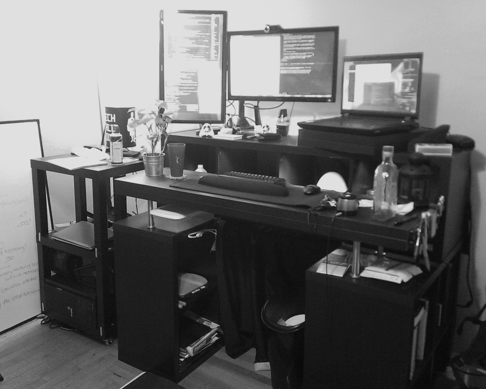

{:title "Homelab"
:author "Ryan Himmelwright"
:layout :page
:page-index 2
:navbar? true}

This is a page where I maintain the status of the computers in my “Homelab”. I will list my current systems here (potentially with screenshots of my current desktop setup for my workstations), as well as network diagrams of our current setup.

## Network
### Network Diagram

## Computers

### Ryan (Me)

#### Alakazam (Main Workstation Laptop)

    System76 Bonobo Extreme
    Intel i7 4810-MQ [2.8 Ghz (3.8 Ghz Turbo), 6M Cache, 4 Cores, 8 Threads]
    16 GB RAM
    Nvidia GTX 970M
    120 GB Samsung EVO SSD
    1 TB 7200 RPM HDD
    17.3” 1920x1080 Display (Also usually connected to 2x 23.6” 1920x1080 Monitors)
    Arch Linux OS

#### Abra (Portable Laptop) -- BROKEN

    Asus X201E-DH01 (Ubuntu Version)
    Intel Celeron 847 [1.1 Ghz, 2M Cache, 2 Cores, 2 Threads]
    4 GB RAM
    320 GB 5400 RPM HDD
    11.6” 1366x768 LED Display
    2.9 Lbs and .9” Thick
    Arch Linux OS

### Rebecca (fiancee)

#### Bellsprout (2014)

    Macbook Air
    Intel i5 (1.4 GHz (2.7 GHz Turbo), 3M Cache, 2 Cores, 2 Threads) ?
    4 GB RAM
    128 GB PCIe Flash HD
    13.3” 1440x900 LED Display
    2.96 Lbs and ~0.7” thick
    Mac OS

### Servers/Other

#### Pallet Town (Webhost)

    Raspberry Pi 2
    ARM Coretx-A7 (900 MHz, 4 Cores, 4 Threads)
    1 GB RAM
    16 GB MicroSD card for HD
    Rasbian OS

#### Ninetales (VM Host / Home Server)

    Lenovo ThinkServer 440
    Intel Xeon E3-1225 v3 [3.2 GHz (3.6 GHz Turbo), 8M Cache, 4 Cores, 4 Threads]
    20 GB ECC RAM
    250 GB Samsung EVO SSD (OS Partition + LVM partion for VM Volumes)
    2 x 1TB WD 7200 RPM HDD (Storage) (Hotswap)
    2 x 3TB TOSHIBA 7200 RPM HDD (ZFS Mirror Storage) (Hotswap)
    Proxmox VE 4.2

    Ninetales KVM VMs:
    Gentoo  - Gentoo  - Vm to play with Gentoo Linux
    test-vm - Various - VM used to test out differnt distros

    Ninetales LXC Containers:
    Diglet  (50)  - Arch Linux   - Minecraft Server
    Staryu  (120) - Arch Linux   - Plex Server
    Meowth  (52)  - Arch Linux   - IRC Chat / Remote Website Writting
    Tangela (114) - Centos 7     - Nginx for Port and Subdomain Proxy
    Geodude (74)  - Ubuntu 16.04 - Gitlab Server

#### Charmander (Test Server / Rebecca’s Gaming Computer)

    My old desktop (first computer build)
    Intel i7-930 [2.8 GHz (3.06 GHz Turbo), 8M Cache, 4 Cores, 8 Threads]
    6 GB RAM
    Nvidia GTX 260
    120 GB Kingston SSD
    Ubuntu MATE 15.10 OS

### Digital Ocean Droplets

#### Pidgey (Owncloud/Test Cloud Server)

    Digital Ocean KVM Droplet
    1 Core
    512 MB RAM
    20 GB SSD
    Ubuntu 14.10 OS

#### Wedding-Server (Himmelwright Wedding Website Host)

    Digital Ocean KVM Droplet
    1 Core
    512 MB RAM
    20 GB SSD
    Ubuntu 14.04 LTS OS

