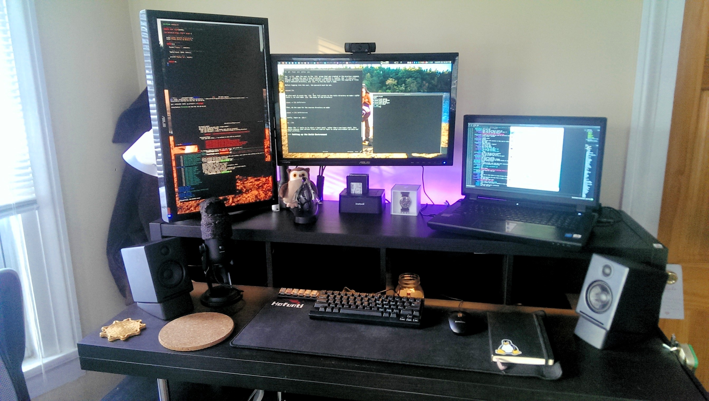
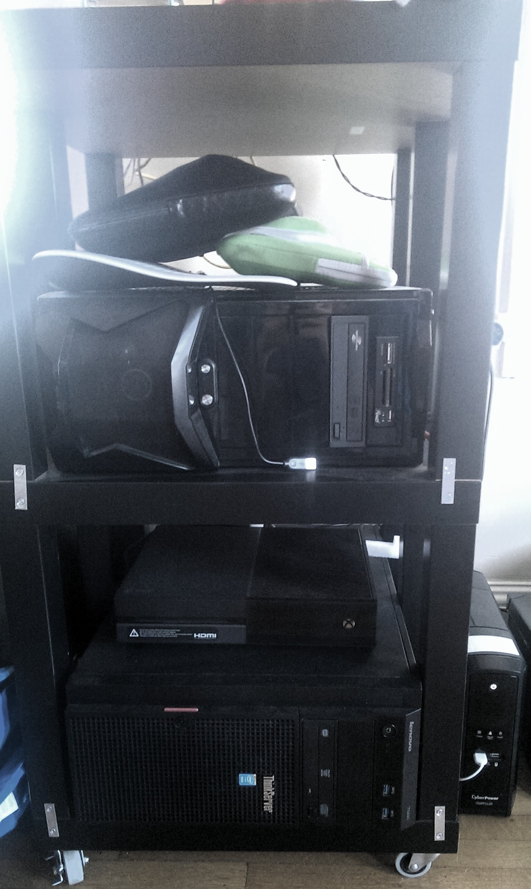
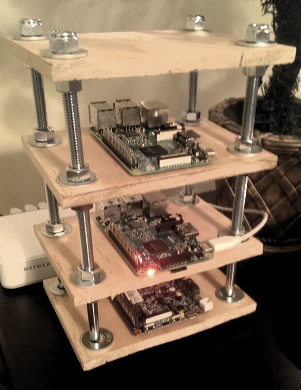

{:title "Homelab"
:author "Ryan Himmelwright"
:layout :page
:page-index 2
:navbar? true}

This is a page where I maintain the status of the computers in my “Homelab”. I will list my current systems here (potentially with screenshots of my current desktop setup for my workstations), as well as network diagrams of our current setup.

## Network
### Network Diagram
[](../../img/homelab/NetworkDiagram.png)
*\* A Little Out of Date*

## Computers

### Ryan (Me)

[](../../img/homelab/alakazam_desk.jpg)
My Workstation Desk

[](../../img/homelab/alakazam.jpg)
My Main Computer Setup (Alakazam)


#### Alakazam (Main Workstation Laptop)
```
System76 Bonobo Extreme
Intel i7 4810-MQ [2.8 Ghz (3.8 Ghz Turbo), 6M Cache, 4 Cores, 8 Threads]
16 GB RAM
Nvidia GTX 970M
120 GB Samsung EVO SSD
1 TB 7200 RPM HDD
17.3” 1920x1080 Display 
Monitors)
Solus
```
##### Periphery
```
2 x 23.6" ASUS 1920x1080 Monitors
Happy Hacking Keyboard Lite 2
Audioengine A2+ Speakers & Stands
Bose AE2 Headphones
Logitech HD Pro Webcam c920 Widescreen
Blue Yeti Microphone - Backout Edition
Inateck USB 3.0 to SATA Dual-Bay Hard Drive Docking Station
```


#### Kadabra (Portable Laptop) 
```
Lenovo x230
Intel i5-3320M [2.6 GHz (3.3 GHz Turbo), 3M Cache, 2 Cores, 4 Threads]
8 GB RAM
250 GB Samsung 850 EVO SSD
12.5" HD LED 1366x768 Display
9-Cell Battery
Solus
```

### Rebecca (Wife)

#### Bellsprout (2014)
```
Macbook Air
Intel i5 (1.4 GHz (2.7 GHz Turbo), 3M Cache, 2 Cores, 2 Threads) ?
4 GB RAM
128 GB PCIe Flash HD
13.3” 1440x900 LED Display
2.96 Lbs and ~0.7” thick
Mac OS
```

### Servers
[](../../img/homelab/rack.jpg)

#### Ninetales (VM Host / Home Server)
```
Lenovo ThinkServer 440
Intel Xeon E3-1225 v3 [3.2 GHz (3.6 GHz Turbo), 8M Cache, 4 Cores, 4 Threads]
20 GB ECC RAM
250 GB Samsung EVO SSD (OS Partition + LVM partion for VM Volumes)
2 x 1TB WD 7200 RPM HDD (ZFS Mirror, for Backups) (Hotswap)
2 x 3TB TOSHIBA 7200 RPM HDD (ZFS Mirror, for Storage) (Hotswap)
Proxmox VE 4.4
```

##### Ninetales KVM VMs:
```	
Gentoo  - Gentoo     - Vm to play with Gentoo Linux
Vomonat - Kali Linux - Used for learning PenTesting techniques
test-vm - Various    - VM used to test out differnt distros
```

##### Ninetales LXC Containers:
```	
Diglet  (50)  - Arch Linux   - Minecraft Server
Staryu  (120) - Arch Linux   - Plex Server
Meowth  (52)  - Arch Linux   - Remote Website Writting/ Other
Kakuna  (14)  - Ubuntu 16.04 - Experimenting with Ledger syncing methods
Tangela (114) - Centos 7     - Nginx for Port and Subdomain Proxy
Geodude (74)  - Ubuntu 16.04 - Gitlab Server
```

#### Charmander (Test Server / Rebecca’s Gaming Computer)

    My old desktop (first computer build)
    Intel i7-930 [2.8 GHz (3.06 GHz Turbo), 8M Cache, 4 Cores, 8 Threads]
    6 GB RAM
    Nvidia GTX 260
    120 GB Kingston SSD
    Ubuntu MATE 15.10 OS

#### CyberPower 1500VA/900W UPS

#### Xbox One


### PI Cluster
[](../../img/homelab/pi-cluster.png)

#### Node 1
```
Raspberry Pi 3
ARM v8 CPU (1.2 GHz, 4 Cores, 4 Threads)
1 GB RAM
MicroSD card for HD
```

#### Node 2
```
Raspberry Pi 2
ARM Coretx-A7 (900 MHz, 4 Cores, 4 Threads)
1 GB RAM
MicroSD card for HD
```
#### Node 3
```
Banana Pi M1
A20 ARM Cortex-A7 Dual Core (2 Cores, 2 Threads)
1 GB RAM
10/100/1000 Ethernet
MicroSD card for HD
```


### Digital Ocean Droplets

#### Pidgey (Nextcloud/Test Cloud Server)

    Digital Ocean KVM Droplet
    1 Core
    512 MB RAM
    20 GB SSD
    Ubuntu 16.04 OS

#### Wedding-Server (Himmelwright Wedding Website Host)

    Digital Ocean KVM Droplet
    1 Core
    512 MB RAM
    20 GB SSD
    Ubuntu 14.04 LTS OS

