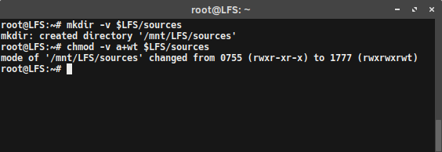
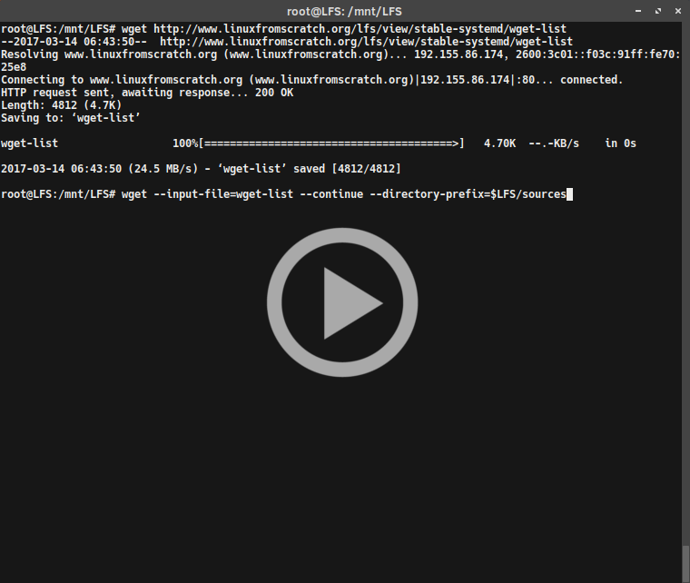
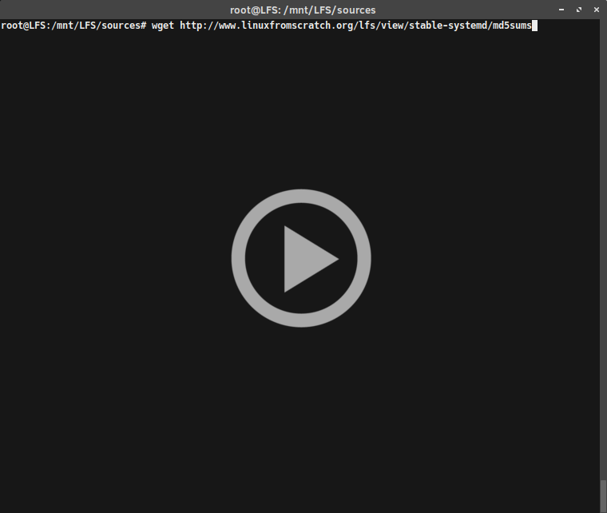

{:layout :post
:title  "Linux from Scratch - Final Preparation Steps"
:date "2017-03-16"
:author "Ryan Himmelwright"
:tags ["Linux" "LFS"]
:draft? true
}


Now that the *repeated* setup steps have been defined in [previous LFS post](../LFS-Repeated=Setup-Steps/), there are a *few* more preparation steps to complete in order to start building the LFS system. I promise... we will start compiling soon. If all goes well, this should be the last preparation post.

<!-- more -->

### Downloading Sources
When it comes down to it, Linux from scratch is just the Linux kernel and a bunch of packages, compiled from source and linked together. To compile all of that, we need the source code... for all of those packages. Luckily, LFS keeps a list of what we need, and makes it simple to download all of it. *(Note: These commands should be run as <b>root</b>)*

<center>

</center>

To make the directory:

```
mkdir -v $LFS/sources
```

The LFS wanted this directory to be writable, and sticky. A "Sticky" directory allows only the file owner to delete a file in the directory. To make the directory both writable and sticky, I used the command:

```
chmod -v a+wt $LFS/sources
```


<center>
 
</center>

To download all of the source packages at once, I first download [the LFS wget list](http://www.linuxfromscratch.org/lfs/view/stable-systemd/wget-list):


```
wget http://www.linuxfromscratch.org/lfs/view/stable-systemd/wget-list
```

After I had the wget list, I could use it as the input-file for wget, to download all the sources with one command:

```
wget --input-file=wget-list --continue --directory-prefix=$LFS/sources
```

It should take a few minutes to download everything (or longer if on a poor connection).


<center>
 
</center>


Since LFS-7.0, there is a [md5sums file](http://www.linuxfromscratch.org/lfs/view/stable-systemd/md5sums) that can be downloaded and used to verify the downloaded packages. Download the file with *wget*:

```
wget http://www.linuxfromscratch.org/lfs/view/stable-systemd/md5sums
```

Then compare the hashes in the list to the [md5sum](https://en.wikipedia.org/wiki/Md5sum) for each of the source packages:

```bash
pushd $LFS/sources
md5sum -c md5sums
popd
```

The results should all be *OK*. If not, try re-downloading the sources and verifying again.


### Creating the $LFS/tools Directory
LFS is built in two main steps. The first builds a set of temporary tools used to build the system, that will not be included as part of the Final LFS system. To help prevent these tools from accidentally being included in the final system, they are kept in a separate directory that can be deleted after they have served their purpose. Make this directory as root:

```
mkdir -v $LFS/tools
```

Next, we will create a `/tools` symlink to the host system. 

```
ln -sv $LFS/tools /
```

This enables the toolchain to be compiled so that it always refers to `/tools`. This ensures that the compiler, assembler, and linker will work in both the first, and second steps of the LFS build.

### Adding the LFS User
Running a system as root is a dangerous. Running the wrong command can completely obliterate a system. Having a typo bork the LFS build, or even the host system, would be insufferable. To prevent this, the book recommends creating an unprivileged user to build the packages from. So, first create an *lfs* group and then add a *lfs* user to it using the commands (as root, ironic for this section...):

```
groupadd lfs
useradd -s /bin/bash -g lfs -m -k /dev/null lfs
```
If you are not familiar with the *useradd* command, here is a quick summary of what all of the flags mean. The `-s /bin/bash` set's our *lfs* user's default shell to *bash*, the `-g lfs` adds the user to the *lfs* group that was created in the previous command, and `-m` creates the user's home directory (*/home/lfs*). Lastly, the `-k /dev/null` changes the input direction to the special null device to prevent the copying of files from a skeleton directory, and *lfs*, is the new user's name.

Before logging into the user, the password must be set. 

```
passwd lfs
```

We also want to grant the *lfs* user full access to the tools directory we made (*$LFS/tools*), so lets make *lfs* the owner of the directory:

```
chown -v lfs $LFS/tools
```

Then, do the same for the sources directory we made:

```
chown -v lfs $LFS/sources
```

Lastly, login as *lfs*!

```
su - lfs
```

*Note: the "-" tells su to start a login shell, rather than a non-login shell. This mostly ensures that various files are read at login to setup environment variable and other profiles.*

### Setting up the Build Environment
