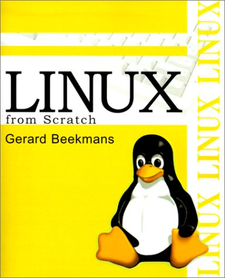
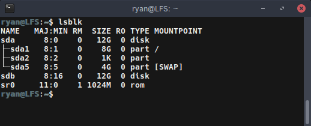

{:layout :post
:title  "Linux from Scratch - Getting Started"
:date "2017-03-01"
:author "Ryan Himmelwright"
:tags ["Linux" "LFS"]
;:draft? true
}

When I started using [Arch Linux](https://www.archlinux.org) a while back, I learn a lot about some of the internals of Linux quickly. Ever since, I have been interested in building a Linux From Scratch by following [the book](http://www.linuxfromscratch.org). Based on my experience with Arch Linux,I think that compiling a system from scratch will help to fill in all the little gaps in my understanding that I might have about how a Linux system works.

<!-- more -->

### Getting Started

First, it should be known that this process follows a book that is freely available at [www.linuxfromscratch.org](http://www.linuxfromscratch.org). The book is updated from time to time, and there are several versions of it (ex: systemd or not). I believe I will attempt to complete the systemd iteration. There are also videos online of people walking through the steps that can be helpful to watch. 

## Setting Up the Host System

LFS is built using a host environment that contains the software required to build and compile all the components of the system. This host system can be your current Linux install, a computer dedicated to LFS, or a Linux virtual machine. The LFS system can then be built in a another partition, or even a separate hard drive.

I am going to setup a KVM virtual machine using Virt Manager for my host system, and then attach a virtual hard drive to build LFS in. I decided just to use a [Ubuntu 16.04 Desktop](https://www.ubuntu.com/download/desktop) install because it should have most of the build tools, and it is easy to install any missing ones. For now, I configured the VM to use 4 cores and 4GB of RAM, but I might decide the increase that when I start compiling packages to speed things up. I also let the installer automatically configure the disks for me, and didn't worry about any of the fancy options like setting up LVM or disk encryption, since it isn't really needed here and I figured if anything it might just confuse me.

After the VM finished installing, I shutdown the system and added a virtual drive. This will be the virtual drive that I build the entire LFS system in. I then started up my VM again and confirmed that everything installed correctly. I also installed and enabled openssh so that I could just ssh into the system from my desktop if I didn't feel like working inside the VM's GUI.

### Setting up the Host Environment
#### Checking Required Packages

Now that the host system is setup, we need to ensure we have a proper host environment to build everything. Luckily, LFS provides us with a nice script that we can copy and paste into a terminal, and it will let us know what required packages and programs we do not have installed. Make sure to run it as either root, or using sudo. When I ran the script, there were a few missing packages that I had to install:

- bison
- gawk
- texinfo (makeinfo)

So I just ran a simple `apt-get install bison gawk texinfo` and I was good to go. I also had a symlink problem because my `/bin/sh` was pointing to `/bin/dash`, and LFS wants it to point to `/bin/bash/`. This was solved by simply re-routing the link with the command `ln -sf bash /bin/sh`.

After installing those few packages and changing the symlink, I the check script was happy.

#### Checking Libraries

After verifying that our host system has all the required packages, we have to check that several libraries are consistent. Again, LFS provides us with a simple script that lets us know if we are good. When I ran it, the three libraries were not found. However, the books states that all the files should either be absent or present. If one or two are there and the others missing, that is a problem. So my system was okay.

### Formatting the LFS Disk
If you haven't formatted the disk to be used for LFS, now is the time to do it. I added a disk through the Virt Manager settings, which doesn't format it, so that must be done. 

I first used `lsblk` to confirm the disk name. In my case it was the `/dev/sdb` disk.

After getting your disk's path, it is time to partition. I decided to partition it as the basic, but very solid ext4 file system using the following command:

`mkfs.ext4 -v /dev/sdX`

Remember to use sudo if you are not root, and replace the /dev/sdX with whatever path you found in the step above (For example, I did `/sudo mkfs.ext4 -v /dev/sdb`). The `-v` isn't required, but I like to see the output. Lastly, note that you can use the `-U` flag to specify a UUID instead of the file path.

The next few preparatory steps before starting to build LFS must be done each time you boot into your host machine, so I think I am going to break that into a separate post. That way, it can be more easily referenced. Stay Tuned!
