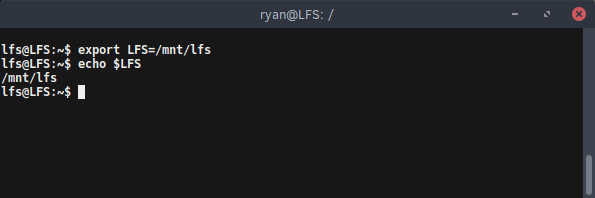
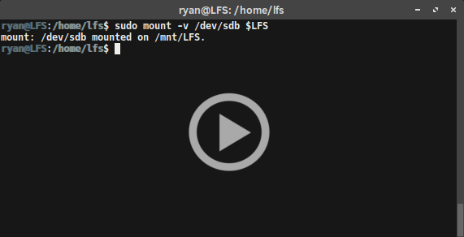

{:layout :post
:title  "Linux from Scratch - Repeated Setup Steps"
:date "2017-03-13"
:author "Ryan Himmelwright"
:tags ["Linux" "LFS"]
:draft? false
}

During the Linux From Scratch process, there may be times when the build environment (computer, VM, chroot, whatever) must be restarted. If so, there are a few steps from the setup phase that have to be re-initialized. This post maps out those steps.

<!-- more -->

### Setting The $LFS Variable
After setting up the virtual disk for my LFS build, I needed to define where I wanted to eventually mount it. This location is important, because it is the path that the $LFS variable is set to. The $LFS variable is used throughout the book, to easily point to where the LFS system is being built.

To set the #LFS variable, I ran the following command: *

`export LFS=/mnt/lfs`

To check that the variable set correctly, just print it out using echo (if successful, the path that was specified should print out).

`echo $LFS`

### Ensuring the $LFS Variable is *Always* Set
There are several ways to ensure that the *$LFS* variable is always loaded during login. One method the book recommends is to edit the *.bash-profile* found in both *~* and */root, by appending the export command defined above to them. This way every time the build machine resets, simply logging into the system (which loads *bash*, assuming it is the default), will export the *$LFS* variable.

### Mounting the LFS Partition(s)

After setting the *$LFS* variable, I could finally mount my LFS drive/partition to that location. First, I ensured that the directory existed by running:

`mkdir -pv $LFS`

*Note: In this command, the -v again means verbose, so a message will be printed for each directory created. The -p flag is for --parents, and will instruct "mkdir" to also make parent directories, as needed. So, if `/mnt/` does not already exist, will be created along with `/mnt/lfs`.*

After creating the directories, I mounted them with the command:

`sudo mount -v -t ext4 /dev/sdb`

If multiple partitions are being used for the LFS build (*such as a separate `/home` partition*), they should also be mounted at this time.

 

After mounting my partition, the LFS book recommended that I check that the partition was not mounted with restrictive permissions. To do this, I ran the `mount` command again, but this time without any parameters. From the output, I was able to see and confirm that the partition was not mounted with restrictive permissions, such as `nosuid` or `nodev`. If either of these options are set, the partition should be remounted.

Lastly, if a *swap* partition is being used, do not forget to enable it using `swapon`:

`swapon -v /dev/xxx`  (with *xxx* the name of the swap partition)

### Conclusion
Remember, if the LFS host system is restarted for any reason, these steps must be completed upon logging into the rebooted system. Even if measures were taking to *always* complete these steps (such as adding the *$LFS* variable to the bash profile, or mounting the partitions via the *fstab* file), it is still a good idea to check and make sure that they *actually* initialized as  intended. This can prevent several headaches down the road.

