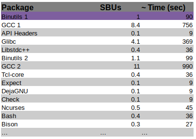

{:layout :post
:title  "Linux from Scratch - SBUs and Binutils"
:date "2017-04-04"
:author "Ryan Himmelwright"
:tags ["Linux" "LFS"]
:draft? false
}

Well, after all of the preparation, we are ready to start compiling packages. This post cover compiling all the packages, but it will detail the first build of [Binutils](https://www.gnu.org/software/binutils/), which is arguably the most important package to compile. Why is Binutils so crucial? It determines the SBU time for your build system. What's an SBU? Read on to find out!

<!-- more -->

### SBUs



*A table of package SBUs and their predicted build time*

When completing LFS, people commonly want to know how long it will take to compile each package. Unfortunately, build times are very much dependent on the power and configuration of the system the packages are being compiled on. Some packages may take a few minutes on a powerful workstation, but hours on an aged laptop. While it cannot be said how long a specific build will take on any device, we can normalize how long each package build takes comparatively to each other. This normalization is done using Stand Build Units, or SBUs.

A SBU is the unit of time measurement it takes to make and install a standard package. Each package in the LFS book has a SBU value, so that build times can be gauged. So, if The first package to be constructed in the book (and in this post), is Binutils, so that is the package which SBUs are normalized to. For example, if it took 10 minutes to build Binutils on your machine, then 1 SBU = 10 minutes for that machine. This means a 4.5 SBU package can be expected to take ~45 minutes to build.

#### SBU Accuracy
SBUs are not completely accurate, and should be used as an estimate at best. Due to the many factors that may differ between setups, SBUs can be off by dozens of minutes in worst-case scenarios. Certain make options might also throw the system off.

For example, systems with multiple cores can run "parallel make" using the `-j` make-flag, as in `make -j4`. This tell *make* to compiled the package using multiple cores. Parallel compilation has the potential to speed up the build process significantly. However, due to how compilation jobs are divided for parallel builds, SBUs are even harder to predict and may be even more sporadic. Just remember that and don't expect too much SBU accuracy when using `make -j`. Also, if you ever run into a problem during a build step, it is a good idea to first retry with a single processor build. If this does not fix the issue itself, the error message can at least be more easily analyzed.

### My Encountered Issues with tar...


 
The first time I attempted to make binutils, I encountered a few errors. The gist of it was that I was not able untar the package correctly, at least from the *lfs* user. Everything worked fine from the *root* or even *ryan* user accounts, but running tar on *lfs* returned the following error:

```
tar (child): bzip2: Cannot exec: Too many levels of symbolic links
tar (child): Error is not recoverable: exiting now
tar: Child returned status 2
tar: Error is not recoverable: exiting now
```
I searched around but much of the initial advice didn't help my problem. It often indicated that my /usr/bin/bzip2 might be a symlink and should be altered. That wasn't the case. Then tried something that illuminated the issue: I removed the `/tools/bin` from the begging of the `path` variable (defined in the *lfs* `.bashrc` file). That temporarily fixed the issues. So I knew the problem was related to the symlink I setup in [the previous LFS post](../LFS-Final-Preparation-Steps), specifically the `ln -sv $LFS/tools /` command. It must have failed and I wasn't paying attention.

Now that I was knew what the problem was, I was able to fix it by running the following commands (some of them might need to be run from a *root/sudo* account):

```
rm -rf $LFS/tools
rm -rf /tools
mkdir -pv $LFS/tools
ln -sv $LFS/tools /
```

These commands remove and reset the `tools` symlinks. I then made sure to re-add `/tools/bin` to the begging of the `path` var in the *lfs* `.bashrc` and test it. Problem fixed!


### Extracting BinUtils

<center>
 
</center>

It is important that Binutils is built first in the process. This is mostly because when Glibc and GCC are built, they perform various tests on the linker and assembler to figure out which of their own features to enable.

To start building BinUtils, move to the sources directory (`$LFS/sources`) and extract the package with (If you encounter issues, see section above):

```
tar xfjv binutils-2.27.tar.bz2
```
*Note: You're version might be different*


The Binutils documentation recommends building it in a dedicated `build` directory, so lets go ahead and make, then enter, that directory:

```
mkdir build
cd build
```
### Making & Executing a Build Script

<center>
 
</center>

Now it is time to build. Normally, this would best be done by sequentially performing a series of *configure*, *make*, and *make install* commands, but for the first binutils compilation, we want to get an accurate reading on how long it takes (to determine our SBU time). To accomplish this easily, I put all of the commands into a bash script. This way, I could execute the script, and easily time the whole process using the `time` utility. To create the script, I wrote the following commands into a file (`build-binutils.sh`):


```
#!/bin/bash

../configure --prefix=/tools            \
             --with-sysroot=$LFS        \
             --with-lib-path=/tools/lib \
             --target=$LFS_TGT          \
             --disable-nls              \
             --disable-werror
make

case $(uname -m) in
  x86_64) mkdir -v /tools/lib && ln -sv lib /tools/lib64 ;;
esac

make install
```

The various options of the `configure` command mean the following:

- `--prefix=/tools`: Configures the build to install the Binutils programs to the /tools directory
- `--with-sysroot=$LFS`: For cross compilation, tells the build system to look in our $LFS directory for the target system libraries, as needed.
- `--with-lib-path=/tools/lib`: configures the library path that the linker should be configured to use.
- `--target=$LFS_TGT`: the machine description in the `LFS_TGT` variable is slightly different than the value returned by the *config.guess* script, so this option will tell the *configure* script to adjust Binutil's build system for building the cross linker.
- `disable-nls`: disables the internationalization, as it is not needed for the temporary tools.
- `disable-werror`: Prevents the build from stopping in the event that there are warnings from the host's compilier.

Also, the `case` statement creates a symlink to ensure the sanity of the tool chain, if building on a *x86_64* architecture.

To runs the script, first make it executable, 

```
chmod +x build-binutils.sh
```

Finally, time and execute the script: 

```
time ./build-binutils.sh
```

When the script completes, the time it took to run it will be printed out. Congratulations, this is the SBU for your system!

Once I had my standard single-thread SBU value, I wanted to do a run with the `-j4` make flag for comparison. To "reset", I deleted the contents of the `binutils/build/` directory, as well as `$LFS/tools/`. I then edited my `build-binutils.sh` script to do a parallel compile by changing `make` line to `make -j4`. I then re-ran the script with `time`. *Note: This is not described anywhere in the official documentation, but is just my best guess at what to do for a re-run of binutils. I very well may be missing steps. However, remember LFS is a learning experience, so we will find out*!

### Checking the Build

<center>
 
</center>

After the build is complete, it is a good idea to run the tests, *especially* for binutils. In this case, use the make command:

```
make -k check
```

### Building the Chapter 5 Tools From Here on Out...
For the sake of time, I will not be writing posts detailing the build process for each of the remaining packages in Chapter 5. I might keep a little log about how each of the builds went and post it, but I am unsure. If I encounter any major snags along the way, I will be sure to write a post detailing them. Otherwise, with any luck, my plan is to keep compiling and see you in Chapter 6!
