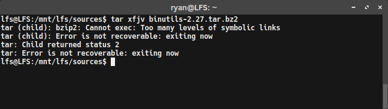

{:layout :post
:title  "Linux from Scratch - SBUs and Binutils"
:date "2017-04-02"
:author "Ryan Himmelwright"
:tags ["Linux" "LFS"]
:draft? false
}

Well, after all of the preparation, we are ready to start compiling some packages. This post won't go into compiling all the packages, but it will detail the first compilation of [Binutils](https://www.gnu.org/software/binutils/), which is one of the most important packages to compile. Why is compiling Binutils so crucial? It determines the SBU time for your build system. What's an SBU? Read on to find out!

<!-- more -->

### SBUs
When completing LFS, people commonly want to know how long it will take to compile the packages. Unfortunately, build times are very much dependent on the power and configuration of the system the packages are being compiled on. Some packages may only take a few minutes on a powerful workstation, but hours on an aged laptop. While we cannot say how long a specific build will take on any device, we can normalize how long each package build takes comparatively to each other. This normalization is done using Stand Build Units, or SBUs.

An SBU is the amount of time it takes to compile a standard package. Each package in the LFS book has a SBU value, so that compilation times can be gauged. So, if The first package to be compiled in the book (and in this post), is Binutils, so that is the package which SBUs are set against. For example, if it took 10 minutes to build Binutils on your machine, then for you, 1 SBU = 10 minutes. So, this means if a 4.5 SBU package is being compiled on that machine, it can be expected to take ~45 minutes to build.

#### SBU Accuracy
SBUs are not completely accurate, because there are still many factors that differ between setups. They should be used as an estimate at best, but remember that they could be off by dozens of minutes in worst-case scenarios.

For example, machines with multiple cores can run a "parallel make" by providing the `-j` makeflag, as in `make -j 4`. This allows the package to be compiled using multiple cores, potentially speeding up the build process significantly. However, due to how compilation jobs have to be divided for parallel builds, SBUs are even harder to predict and may be even more sporadic. Just remember that. Also, if you ever run into a problem during a build step, it is a good idea to first retry it with a single processor build. If this doesn't fix the issue itself, the error message can at least be properly analyzed.

### My Encountered Issues with tar...


 
The first time I attempted to build binutils, I encountered a few errors. The jist of it was that I could not untar the package correctly, at least from my *lfs* account. When I would switch to the *root* or even *ryan* user accounts, everything worked fine. Running tar on *lfs* returned the error:

```
tar (child): bzip2: Cannot exec: Too many levels of symbolic links
tar (child): Error is not recoverable: exiting now
tar: Child returned status 2
tar: Error is not recoverable: exiting now
```
I searched around but most of the advice didn't help my problem. Most of it was indicating that my /usr/bin/bzip2 might be a symlink and should be altered. But that wasn't the case. However, I did try something that illuminated the issue: I removed the `/tools/bin` from the begging of the `path` variable, defiend in the *lfs* `.bashrc` file. That temporarily fixed my issues. So I knew it was with the symlink I setup in [the previous LFS post](../LFS-Final-Preparation-Steps), specifically the `ln -sv $LFS/tools /` command -- it must have failed and I wasn't paying attention.

Now that I was knew what the problem was, I was able to fix it by running the following commands (some of them might need to be run from a *root/sudo* account):

```
rm -rf $LFS/tools
rm -rf /tools
mkdir -pv $LFS/tools
ln -sv $LFS/tools /
```

These commands remove and reset the `tools` symlinks. I then made sure to re-add `/tools/bin` to the begging of the `path` var in the *lfs* `.bashrc`. Problem fixed!

### Building Notes?


### Building BinUtils
It is important that Binutils is built first. This is mostly because when Glibc and GCC are built, they perform various tests on the linker and assembler to figure out which of their features to enable.

To start building BinUtils, first move to the sources directory (`$LFS/sources`) and extract the package with:

```
tar xfjv binutils-2.27.tar.bz2
```
*Note: You're version might be different*

<center>
 
</center>


The Binutils documentation recommends building it in a dedicated `build` directory, so lets go ahead and make and enter that:

```
mkdir build
cd build
```
#### Making a Build Script
Now it is time to build. Normally, this would be best done by sequentially performing a series of *configure*, *make*, and *make install* commands, but for this compilation, we want to get an accurate reading on how long it takes (to record our SBU time). So, I put all of the commands into a bash script, so that I could execute the script, and easily time the whole process using the unix `time` command. So for the script, I just wrote all of the commands in one file (`build-binutils.sh`):


```
#!/bin/bash

../configure --prefix=/tools            \
             --with-sysroot=$LFS        \
             --with-lib-path=/tools/lib \
             --target=$LFS_TGT          \
             --disable-nls              \
             --disable-werror
make

case $(uname -m) in
  x86_64) mkdir -v /tools/lib && ln -sv lib /tools/lib64 ;;
esac

make install
```

Then, to runs the script, first make it executable, 

```
chmod +x build-binutils.sh
```

Then time and execute the script: 

```
time ./build-binutils.sh
```


<center>
 
</center>


#### Checking the Build

<center>
 
</center>
