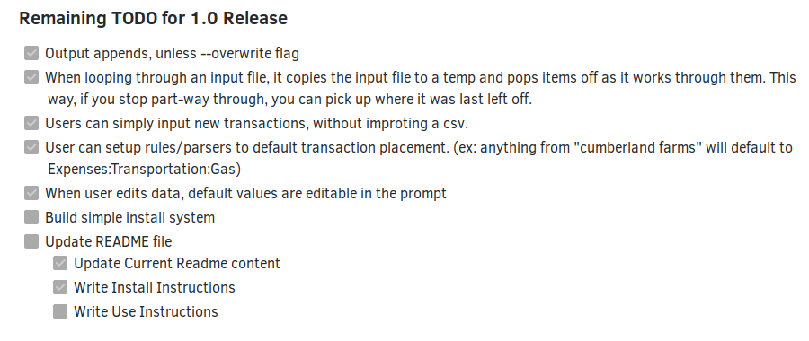

{:layout :post
:title  "LIA 1.0 Beta Released"
:date "2017-04-17"
:author "Ryan Himmelwright"
:tags ["Dev" "Solus" "Python" "Ledger"]
:draft? False
}

I have released the 1.0 Beta version for a personal project of mine: the **L**edger **I**mport **A**ssistant, or [LIA](https://github.com/himmALlRight/LIA/). This post will talk briefly about the background of LIA, what it does, and explain the beta release. 

<!-- more -->

## What is LIA?

*Example Cred Card Statement CSV File*

A while ago, I discovered [Ledger](http://www.ledger-cli.org), the command line double-entry accounting application. Its powerful, yet simple design attracted me, and I wanted to try it out. To use it effectively however, I needed a method to import our bank and credit card statements into ledger journals. Then, I could use ledger to analyze the finances. However, there was an issue. While there are several great ledger convert/import options out there, many were more complicated than what I was looking for. So...I wrote my own. 

*Example Ledger Journal File*

When I started writing LIA, I just wanted a python script that could help me convert the contents of a .csv file into a ledger-journal formatted file (without any of the fancy features. Just the basics). I thought it was a simple task and should only take me a few hours. It was, and it did. I wrote the the first basic implementation of LIA on a Sunday afternoon. While coding that bare-bones version, I realized that even though it *technically worked*, it would not be enjoyable to use, and therefore I would never use it. So I decided to expand it into a full project, something more than a simple script.

## What does LIA do?

LIA executes the core functionality that originally prompted me to write it: converting bank/credit card statement csv files into ledger journal files. Beyond that basic functionality,  LIA has a few nice features that help the user manually convert these files in an enjoyable way. By going through each transaction manually, the user has full control to make sure data is being input correctly. However, LIA helps make this otherwise dull process fast and efficient. Some of LIA's features that help accomplish this are:

- Data order is recognized by a header mechanism
- Prompts the user to potentially edit the transaction information 
- Sets default transaction information from the values of the csv file
- Manual transaction entries when needed (No input file)
- Supports multiple destination accounts
- Automatic placement system. The user can specify a file containing rules to automatically place transactions. (ex: anything with "Dunkin" in the description will default to Expenses:Food:Coffee)
- Colored prompts

## What does LIA 1.0 Beta mean?
### LIA 1.0

*My Todo list to release the 1.0 Version*

When I expanded LIA to a personal project, I recorded several features that would make converting CSV statements easier, and got started. I worked on the project here and there, adding each feature over time. These features are what I determined were required in order for the application to be acceptably *usable*. When all of those requirements were met, I would release an official 1.0 Branch.

The main functionality of LIA has been implemented for a while now. Being a python application, it has been possible to run LIA by calling the files with python. However, I didn't want to release the 1.0 version without first making an installer. I wanted LIA to be run like a normal linux application. I have now finished configuring the project and a `setup.py` file, so users can use python's setuptools to install LIA as an application on their computer. Additionally, I have even packaged LIA as a Solus eopkg. It looks like I am ready for release.

### Beta
Sort of. Until now, I have been developing, but not using LIA day to day. I want to spend some time actually *using* the application to see if there are any remaining issues. Also, I have not confirmed that it fully does what is needed for ledger. I want to get a few ledger users to quickly look at it and let me know if they see any issues. After testing it for a bit, I will release it as the official 1.0 release. This will mean it should be stable enough for people to use, if they so choose to.

## More Information
To test out LIA, read some documentation, or find out more  [check it out](https://github.com/himmAllRight/lia/) on [my github page](https://github.com/himmAllRight). I plan to continue to develop it further in the future. If you have a suggestion, or even some code you'd like to contribute, feel free to let me know, either on github or my [other contact methods](../../pages//about/). Enjoy!