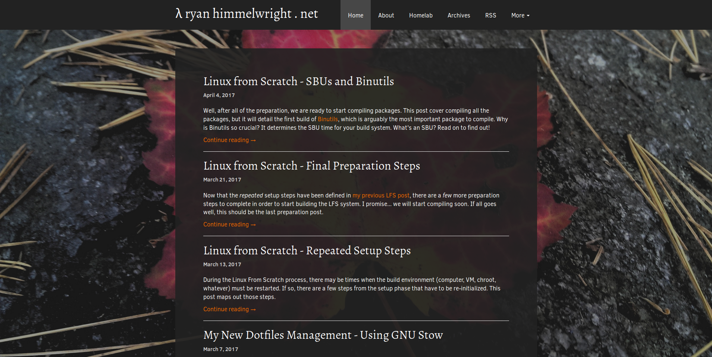

{:layout :post
:title  "New Website Theme: Immutable"
:date "2017-04-10"
:author "Ryan Himmelwright"
:tags ["Website" "Design"]
:draft? false
}

When I first started using [Cryogen](http://cryogenweb.org) to generate this website, I wanted to create personalized theme. This desire resulted in me hacking together a mutant from the default theme, which I boringly named "<i>ryan1</i>" (I anticipated it to be temporary). It looked like a relic, designed from the time when I first learned how to make a web page... the early 2000's. Like many websites from that time, it was also not mobile friendly. I hope to change that, by introducing my new website theme: <b><i>Immutable</i></b>.

<!-- more -->

While possibly could still look dated (I hope I'm at least getting better...), it addresses my of the issues I had with my *ryan1* theme. I will explain and give some examples of these improvements below:

Homepage with the old Theme

Homepage with the new Immutable Theme

### Removed the Sidebar & Dispersed Its Contents

The sidebar components have been distributed to other parts of the site

I have to be honest here... I sort of still planned on keeping the side bar when I started to build the theme. I liked how it held all of my links (Github, LinkedIn, etc), the recent posts and tags in one, easy to find location. I also liked having my avatar picture in the side bar to make the site more personable. After working on the base of the theme however, I realized it might be better off without it. I've relocated the items to other locations of the site. The majority of the links have been relocated to the drop-down menu (icon images included :D ), and I was at least able to add my picture to the [About Page](../../pages/about/).

I might reinstate a sidebar in the future, but only if it looks *good* and I can add it *correctly*. The way I implemented the old sidebar is actually what caused many of the issues prompting this new theme, and I do not want to bring back those problems.

### Removed the Bad Footer

Bad Footer Placements

One of the issues created by the sidebar and my poor css floats, was the footer. One pages where the main content section was large enough, it consisted as a dark gray bar along the bottom of the page, and looked fine. However, when viewing a page with a small content section, such as the *About* page, the footer would rise up and behind the sidebar, looking terrible. It was something that bothered me every time I saw it, and was probably an easy fix, but I never felt like sitting down to fix it.

New Footer

Luckily in the *Immutable* theme, I have fixed the footer. I also have removed the gray bar, because I think it would just clutter up the page more. The background looks great, and the text is clear over it. I really just need a small copyright statement and I like having the [Cryogen](http://cryogenweb.org) shout-out here. So that's all I have for the footer.

### Mobile Support

Mobile viewing the homepage and a post, on both the old theme and Immutable

My biggest reason for making the new theme was that viewing the website on a mobile device was a poor experience. By poor experience, I mean it was basically unusable. Again, because I had the sidebar setup poorly, it remained on the side... even on mobile. This meant there was not enough room for the actual main content section, and pages/posts were a skinny line of text down the side of the phone. Don't get me started  on how images were displayed. 

### Mobile Navigation

Main navigation drop-down and the extended drop-down menu on mobile

### Continued Work
The theme's name might be *immutable*, but work on it isn't. There are still several things I plan on tweaking over time. 