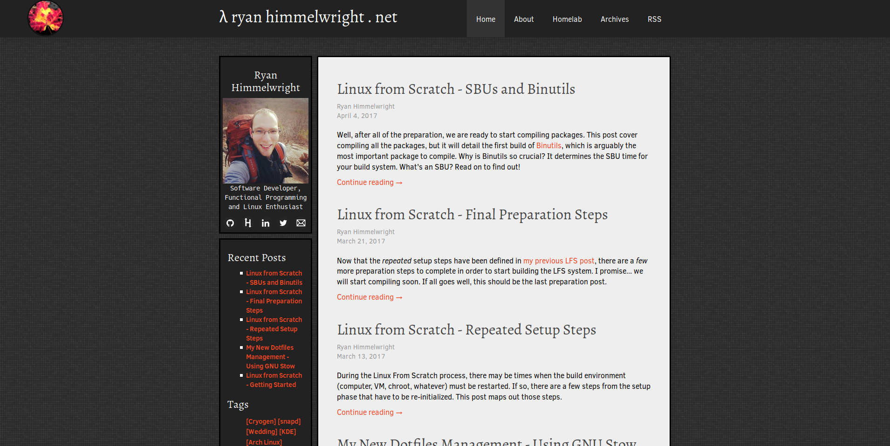

{:layout :post
:title  "New Website Theme: Immutable"
:date "2017-04-10"
:author "Ryan Himmelwright"
:tags ["Website" "Design"]
:draft? false
}

When I first started using [Cryogen](http://cryogenweb.org) to generate this website, I wanted to create personalized theme. This desire resulted in me hacking together a mutant from the default theme, which I boringly named "<i>ryan1</i>" (I anticipated it to be temporary). It looked like a relic, designed from the time when I first learned how to make a web page... the early 2000's. Like many websites from that time, it was also not mobile friendly. I hope to change that, by introducing my new website theme: <b><i>Immutable</i></b>.

<!-- more -->

While possibly could still look dated (I hope I'm at least getting better...), it addresses my of the issues I had with my *ryan1* theme. I will explain and give some examples of these improvements below:

*Homepage with the old Theme*

*Homepage with the new Immutable Theme*

### Removed Sidebar

*The sidebar components have been distributed to other parts of the site*

I have to be honest here... I sort of still planned on keeping the side bar when I started to build the theme. I liked how it held all of my links (Github, LinkedIn, etc), the recent posts and tags in one, easy to find location. I also liked having my avatar picture in the side bar to make the site more personable. After working on the base of the theme however, I realized it might be better off without it. I've relocated the items to other locations of the site. The majority of the links have been relocated to the drop-down menu (icon images included :D ), and I was at least able to add my picture to the [About Page](../../pages/about/).

I might reinstate a sidebar in the future, but only if it looks *good* and I can add it *correctly*. The way I implemented the old sidebar is actually what caused many of the issues prompting this new theme, and I do not want to bring back those problems.

### Removed Bad Footer

### Mobile Support

### Mobile Navigation

### Continued Work