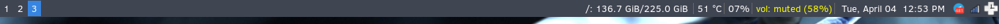
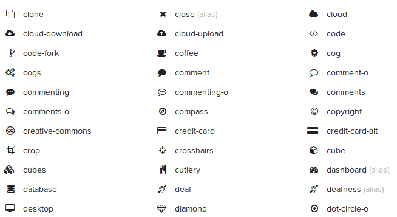

{:layout :post
:title  "Refreshing my i3 setup with i3blocks"
:date "2017-06-21"
:author "Ryan Himmelwright"
:tags ["Linux" "i3" "customization" "Solus"]
:draft? false
}

The last couple of weeks I have shifted back to using the i3 window mangers. When I first fired it up again, my fingers danced across the keyboard, remembering all of the personalized keybindings I have cultivated in my i3 configuration over the years. It is a simple, beautiful setup... except for one part. My i3status bar was looking rather blaned and dated, expecially comparted some of the i3 setups posted by all the cool kids over at [/r/unixporn](https://www.reddit.com/r/unixporn/). So, I decided it was time for a refreash.

<!-- more -->

## i3status


<div id="caption">One of my simple i3status setups</div>

When I first configured i3 seceral years ago, I used i3status because it was easy to setup with i3 and did what it needed by default. Over time, I learned how to create and modify [my own .i3status.conf](https://github.com/himmAllRight/dotfiles/blob/master/i3/.config/i3/i3status.conf) so that I could tweak it to play nice with my occasionaly unstandared configurations (ex: `/Data` partitions and such). While i3status served me well for many years, using the same-old setup has become boring. I started to notice several other really nice looking status bar tools being used in i3 setups, and wanted to try them out.

## Polybar


<div id="caption">The example polybar</div>

The first bar I saw and tried was [polybar](https://github.com/jaagr/polybar). I started with it because some of the examples or it are really awesome. It is a bar that looks very modern and has an infinate number of features. I got it setup and was able to use the example bar just fine. However, when I started to configure my own, I started to run into issues with it being able to detect my workspaces and other elements. After some frustration, I put it aside for a bit and decided to see what else is out there.

## i3blocks
Next, I learned of [i3blocks](https://github.com/vivien/i3blocks). It appeared to have everything I wanted for by status bar, but yet was simple and respected the [i3bar protocol](https://i3wm.org/docs/i3bar-protocol.html). So I tried it out.

### Downloading from the Repos
Just like installing any other package on Linux, I decided to first check to see it it was in the [Solus Repos](https://dev.solus-project.com/):

```
sudo eopkg sr i3block
```

and it was, so I installed it from there, and started learning how to setup my configuration.

### Fonts


<div id="caption">A *Very Small* Sampling of the Awesome Fonts</div>

The first hurdle I had when I first launched i3blocks was that I did not have the fonts which the default configuration used installed on my computer. I removed the special fonts from the config, just to check that everything was working. But what's the fun in that? One of the biggest reasons I was upgrading my i3bar was to have cool modern font icons! So, I found the [font awesome](http://fontawesome.io/) package in the Solus repos and installed it.

```
sudo eopkg it font-awesome-ttf
```

With the awesome fonts at my disposal, I had a plethora of icon images to use. So I went through and picked out icons for each of the browser tabs, and status markers.

### Finding a Git Repos


<div id="caption">Example of Modules in new i3-block repo</div>

While researching how to configure i3blocks, I started finding several different github repos and forks of the project. Some of the forks seemed to have additional modules that my repo version did not have. So, I downloaded and built [this one](https://github.com/Anachron/i3blocks) to try out. I configured i3 to point to the new build instead, and started to setup my own modules.

### Forking my own for Solus Tweaks
As I was configuring the individual models, I noticed that many of them didn't work by default on my computers. I dug deeper by going looking at the scripts that the modules refer to, and noticed that many of them were trying to querry the data from applications that are not used in Solus. For example, the `battery` block didn't work because it relied on `acpi`, which is used often in Arch Linux for battery information (I use it myself when on arch). However, Solus uses `upower`. So, I cobbled together my own `battery` bash script, that querries battery information using `upower` instead (Note, the `BATTERY_ICON` uses the battery fonts. Unless it is charging... then it uses a lightning bolt :) ).


<p>
```
#!/bin/bash

BATTERY=0
BATTERY_STATE=$(echo "${BATTERY_INFO}" | upower -i $(upower -e | grep 'BAT') | grep -E "state|to\ full" | awk '{print $2}')
BATTERY_POWER=$(echo "${BATTERY_INFO}" | upower -i $(upower -e | grep 'BAT') | grep -E "percentage" | awk '{print $2}' | tr -d '%')
URGENT_VALUE=10

if [[ "${BATTERY_POWER}" -gt 87 ]]; then
    BATTERY_ICON=""
elif [[ "${BATTERY_POWER}" -gt 63 ]]; then
     BATTERY_ICON=""
elif [[ "${BATTERY_POWER}" -gt 38 ]]; then
     BATTERY_ICON=""
elif [[ "${BATTERY_POWER}" -gt 13 ]]; then
     BATTERY_ICON=""
elif [[ "${BATTERY_POWER}" -le 13 ]]; then
     BATTERY_ICON=""
else
    BATTERY_ICON=""
fi


if [[ "${BATTERY_STATE}" = "discharging" ]]; then
    echo "${BATTERY_ICON} ${BATTERY_POWER}%"
    echo "${BATTERY_ICON} ${BATTERY_POWER}%"
    echo ""
else
    echo " ${BATTERY_POWER}%"
    echo " ${BATTERY_POWER}%"
    echo ""
fi

if [[ "${BATTERY_POWER}" -le "${URGENT_VALUE}" ]]; then
  exit 33
fi
```
</p>

It seems to work well enough. As I continued to *tweak*, or downright *create* blocks to work well in Solus, I eventually decided that it might be a good idea to [create my own fork](https://github.com/himmAllRight/i3blocks) of the repo. This way, I can have my own i3blocks repo that works well with Solus. I noticed that the implementation of `i3blocks` in the Solus repos is also using non-Solus items for it's scripts (ex: acpi for the battery). Maybe one of these days I'll jump into irc and see how people feel about swapping in mine instead (or at least one that works in Solus)...


### Color Update for i3 & rofi

When I started using i3 several years ago, I used [dmenu](http://tools.suckless.org/dmenu/) as my launcher (it's the launcher used in [dwm](http://dwm.suckless.org/), which used to compete with i3 for my attention). I eventually switched to [rofi](https://davedavenport.github.io/rofi/) after seing it used in some very nice i3 setups (sound familiar?). However, I always used the ugly default theme and never bothered to fix it. With all the work I did making i3bars look nice, I figured I should at least make rofi match. Making the color theme wasn't nearly as hard as I thought it would be. Mostly because I found and used [rofi theme generator](https://davedavenport.github.io/rofi/p11-Generator.html). The end result:


<div id="caption">New color scheme for rofi launcher</div>

While touching up rofi, I learned of it's ability to easily switch through already opened windows (I used to only use it to launch new programs). What I liked was that in i3, it also displayed the workspace the window is one, icon and all. So, I bound it to my Super+Tab key for easy use.


<div id="caption">Newly configured rofi window switcher</div>

## Conclusion


<div id="caption">My current i3blocks setup</div>


