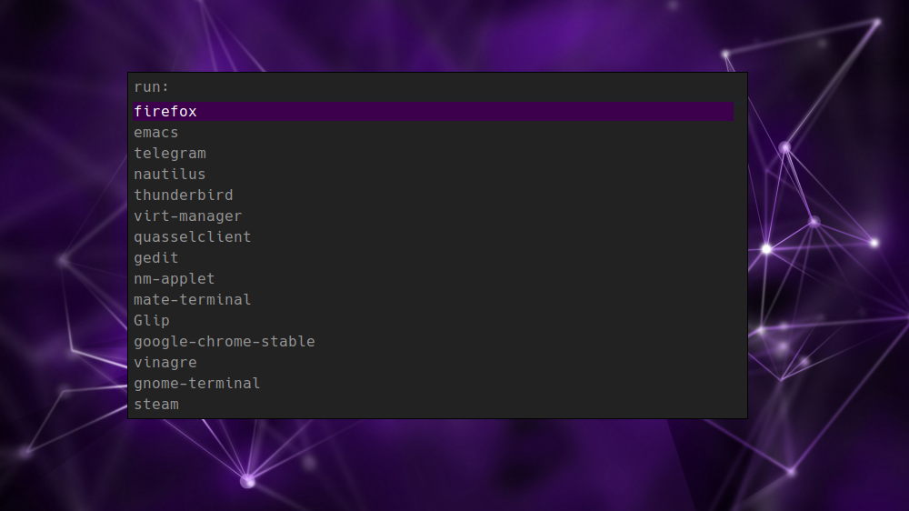

{:layout :post
:title  "Refreshing my i3 setup with i3blocks"
:date "2017-06-22"
:author "Ryan Himmelwright"
:tags ["Linux" "i3" "customization" "Solus"]
:draft? false
}

The last couple of weeks I have shifted back to using the i3 window mangers. When I fired it up, my fingers danced across the keyboard, remembering all of the personalized keybindings I have cultivated in my i3 configuration over the years. It is a simple, beautiful setup... well, beautiful minus one of the components. My i3status bar was looking rather bland and dated, especially compared some of the i3 setups posted by all the cool kids over at [/r/unixporn](https://www.reddit.com/r/unixporn/). I decided it was time for a refresh.

<!-- more -->

## i3status


<div id="caption">One of my simple i3status setups</div>

When I first configured i3 several years ago, I used i3status because it was easy to use with i3 and did everything by default. Over time, I learned how to create and modify [my own .i3status.conf](https://github.com/himmAllRight/dotfiles/blob/master/i3/.config/i3/i3status.conf) so that I could get it to play nice with un-standerd configurations (ex: `/Data` partitions and such). While i3status served me well for many years, using the same-old setup has become boring. I started noticing several other nice looking status bar tools being used in i3 setups, and wanted to try them out.

## Polybar


<div id="caption">The example polybar</div>

The first bar I saw and tried was [polybar](https://github.com/jaagr/polybar). I started with it because some of the examples look awesome. It looks very modern and has an infinite number of features. I set it up and was able to use the example bar just fine. However, when I started to customize my own, I started to run into a few issues. The biggest issue was polybar not detecting my work-space names, along with other elements. Additionally, due to the support for several window managers, the example configuration file seemed cluttered, and I was never sure what I could edit, and what I should delete. After some frustration, I decided put it aside for now. I might come back to it one day when I'm bored.

## i3blocks
Next, I learned of [i3blocks](https://github.com/vivien/i3blocks). It appeared to have everything I wanted in a status bar, yet remained simple, respecting the [i3bar protocol](https://i3wm.org/docs/i3bar-protocol.html). So I gave it a whirl.

### Downloading from the Repos
Just like installing any other package on Linux, I decided to first check to see it it was in the [Solus Repos](https://dev.solus-project.com/):

```
sudo eopkg sr i3block
```

It was. So, I installed it (`sudo eopkg it i3blocks`) and started learning how to setup my configuration.

### Fonts


<div id="caption">A *Very Small* Sampling of the Awesome Fonts</div>

The first hurdle I came across when first launching i3blocks was that I did not have all the fonts used in the default configuration installed. I temporarily removed the special fonts from the config, just so I could check that everything was working. But what's the fun in that? One of the biggest reasons I wanted to redo my bar was to have cool modern icon fonts! So, I found the [font awesome](http://fontawesome.io/) package in the Solus repos and installed it.

```
sudo eopkg it font-awesome-ttf
```

With the awesome fonts at my disposal, I had a plethora of icons to use. So I went through and picked out icons for each of the work-space tabs and status markers.

### Finding Git Repos


<div id="caption">Example of Modules in new i3-block repo</div>

While researching how to configure i3blocks, I started encountering several different GitHub repos and forks of the project. Some forks seemed to have additional modules that my repo version didn't. I downloaded and built [this one](https://github.com/Anachron/i3blocks) to try out. I then configured i3 to point to the new build instead, and got started setting up my own blocks.

### Forking my own for Solus Tweaks
As I was configuring the individual blocks, I noticed that many of them didn't work by default on my computers. I dug deeper by opening up and peeking at the actual bash scripts blocks refer to. I noticed that many of them were trying to query data from applications that are *not* used in Solus. For example, the `battery` block didn't work for me because it relied on `acpi`, which, while often used in Arch Linux for battery information (I use it myself when on arch) is not packaged in Solus. Instead, Solus relies on `upower`. To fix my issues, I cobbled together my own `battery` bash script, that queried battery information using `upower` instead. Note, the `BATTERY_ICON` uses the battery fonts (which likely won't show in the browser). Unless it is charging... then it uses a lightning bolt :) .


<p>
```
#!/bin/bash

BATTERY=0
BATTERY_STATE=$(echo "${BATTERY_INFO}" | upower -i $(upower -e | grep 'BAT') | grep -E "state|to\ full" | awk '{print $2}')
BATTERY_POWER=$(echo "${BATTERY_INFO}" | upower -i $(upower -e | grep 'BAT') | grep -E "percentage" | awk '{print $2}' | tr -d '%')
URGENT_VALUE=10

if [[ "${BATTERY_POWER}" -gt 87 ]]; then
    BATTERY_ICON=""
elif [[ "${BATTERY_POWER}" -gt 63 ]]; then
     BATTERY_ICON=""
elif [[ "${BATTERY_POWER}" -gt 38 ]]; then
     BATTERY_ICON=""
elif [[ "${BATTERY_POWER}" -gt 13 ]]; then
     BATTERY_ICON=""
elif [[ "${BATTERY_POWER}" -le 13 ]]; then
     BATTERY_ICON=""
else
    BATTERY_ICON=""
fi


if [[ "${BATTERY_STATE}" = "discharging" ]]; then
    echo "${BATTERY_ICON} ${BATTERY_POWER}%"
    echo "${BATTERY_ICON} ${BATTERY_POWER}%"
    echo ""
else
    echo " ${BATTERY_POWER}%"
    echo " ${BATTERY_POWER}%"
    echo ""
fi

if [[ "${BATTERY_POWER}" -le "${URGENT_VALUE}" ]]; then
  exit 33
fi
```
</p>

Over the past few weeks, it seems to work well enough. As I continued to *tweak*, or downright *create* blocks to work well in Solus, I eventually decided that it might be a good idea to just [create my own fork](https://github.com/himmAllRight/i3blocks) of the repo. This way, I can have my own i3blocks repo that works well with Solus. I noticed that the implementation of `i3blocks` found in the Solus repos is also using non-Solus items for it's scripts (ex: acpi for the battery). Maybe one of these days I'll jump into irc and see how people feel about swapping in mine instead (or at least one that works better in Solus)...


### Color Update for i3 & rofi


<div id="caption">New color scheme for rofi launcher</div>

When I started using i3 several years ago, I used [dmenu](http://tools.suckless.org/dmenu/) as my launcher (it's the launcher used in [dwm](http://dwm.suckless.org/), another tiling window manager I used to use). I eventually switched to [rofi](https://davedavenport.github.io/rofi/) after seeing it used in some very nice window manager setups (sound familiar?). However, I always used the plain default theme and never bothered to improve it. With all the work I did making i3bars look nice, I thought I should at least make rofi match. Making the color theme wasn't nearly as hard as I anticipated it to be. That's mostly because I found and used the [rofi theme generator](https://davedavenport.github.io/rofi/p11-Generator.html). 

<center>

</center>
<div id="caption">Newly configured rofi window switcher</div>

While touching up rofi, I learned it can also switch through already opened windows (Previously, I  only used it to launch new programs). I really liked that in my new i3 setup, it also displayed the work-spaces, icon font and all. I immediately bound it to my Super+Tab key for easy use.


## Conclusion
<video width=100% controls>
  <source src="../../img/posts/starting-i3/i3-gaps-demo.mp4" type="video/mp4">
  <source src="movie.ogg" type="video/ogg">
Your browser does not support the video tag.
</video>
<div id="caption">Little video demoing my new i3gaps setup with i3blocks</div>

Thus far, I have been very satisfied with my current i3 setup. Replacing i3status with i3blocks, combined with adding small improvements, for example, the awesome fonts, really helped to enhance the look and feel of my i3 configuration. Additionally, ROFI much better now that it matches everything.

I am glad to be using i3 again. It is so efficient to use and I love flying around the work-spaces and windows. It is particularly useful on [kedabra's](../../pages/homelab/#kadabra) 12" screen, as it utilizes all of the limited resolution. If you have never used a tiling window manager in Linux, I strongly suggest you give it a shot. It can take some time to get up and going the first time, but once a custom configuration is built, it always feels like home.

To show off my new i3 setup with i3bars, I've posted a small video at the top of this section. Enjoy!
