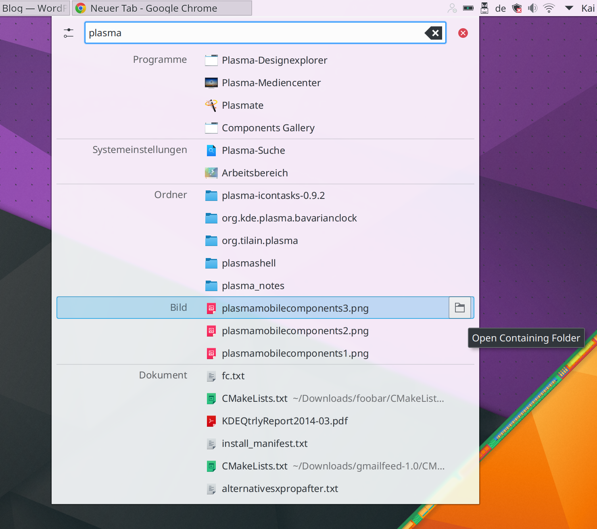

{:title "Trying Out the Plasma 5 Desktop Environment"
 :date "2016-06-26"
 :layout :post
 :author "Ryan Himmelwright"
 :tags ["Linux" "Arch Linux"]}

After watching the continued development of the Plasma 5 desktop
environment from a distance, I determined I needed to give it another
try. It was just before version 5.6 was released, and the project
appeared to be finding it's stride. Right up front, I want to come
clean and admit that I have never really liked the KDE/Plasma desktop
environment (more on that below). However, with that said... I am still
using the plasma desktop on my main computer (months later, and
haven't aborted yet**...). Here are my thoughts.

<!-- more -->

### My History with KDE/Plasma 

Now, as I said above, _I have never really liked KDE (now Plasma)_. In
fact, sometimes I down right _hated_ it. It is a great project, and I
_wanted_ to like it. It has so many features and is amazing
for power users. I have tried it again and again, desperately wanting
to be swept off my feet, but it's design always kept me bolted to the
ground. The theming made me feel like I was using a Fisher-Price
operating system (which is ironic, because like I said... the plasma
desktop is probably one of the best power user environments out
there). The bulky features always made it feel childish. So, with that
said... I have been using using the Plasma desktop on all of my
personal computers for several months. Here are my thoughts.

### Pros
* **The theming has come a long way**. It no longer looks like a
  child's toy. Even the default theme is _very_ appealing. Also, it
  has *dark themes*, which I am always a fan of.

* **I Love the customization.** I love the level of customization
  the plasma desktop allows. I can set transparency, add/remove
  panels or widgets, set custom keybindings (very important to me),
  and a bunch of other operations very easily.

* **Lets me hide window bars** One customization I love is the ability
  to hide the window bars. I am not a fan of window bars, because I
  think they look clunky and just take up space. One feature I like
  about many tiling window managers is it is usually very easy to hide
  the window bars. However, that isn't always the case in Desktop
  Environments, but I was pleased with how easy it was to do it in
  Plasma.

* **It Lets me create an awesome-wm environment, but as a full DE**
  Similar to above, I am able to implement some of the features I love
  about tiling window managers like awesome and i3, but with the full
  desktop environment. In addition to removing window bars, I like to
  easily move and resize windows by hitting the meta or alt key and
  left/right clicking the windows. Again, in Plasma this was simple.

* **I love krunner. A lot.** I like using application launchers, and
  krunner looks nice, is lightning fast, and gets the job done. I
  didn't really know much about krunner during previous attempts at
  using KDE. This was definitely contributor to why I liked it much
  more this time around.
  

  
* **The ability to use old-school animations is fun** There is not much to say
  here. While not very practical, sometimes spinning a desktop cube is
  just straight up _fun_.
  

  
* **Fast. Even for a full DE**

### Cons
* **Multi-monitor support. WTF.** This was by far the biggest issue I
  had. My main computer is a 17" laptop that I connect to two 24"
  displays. However, because it is a indeed a laptop, I sometimes move
  it around and be semi-mobile with it. This requires disconnecting the
  monitors and going from 1 screen to 3 or vice-versa. Well it turns
  out that this is usually a pain in the ass for me in Plasma. First,
  I have to configure the monitors one-by-one, hitting "apply" between
  each configuration (it doesn't like when I try to move and place all
  3 displays in one swoop). Second, once I setup the screen placement,
  the panels often go crazy and can't be found, or I have to play
  with them to set them up correctly. Lastly, sometimes the displays
  overlap each other oddly, even though they appear normal in the
  display settings. The wallpapers almost never set correctly and my
  right-click menu is disabled on some screens but not
  others. Basically, it's just a hot mess and the most infuriating
  problem I faced when using Plasma. If I used a laptop without
  monitors, or even a permanent desktop setup, I would be
  fine. However, that is not my use case.
  

  
* **Randomly just stops working** Sometimes, KDE applications just
  crash and I can't seem to get them back. Widgets seemed to beak
  things more frequently, so I just stopped using them. (Again, not a
  good solution)
* **A full DE** While I said above that it was nice having an
  environment that resembled a window manager, but had the benefit of
  the full suite of applications that come with a desktop environment,
  sometimes it was also a pain. There's just a lot of crap that I
  don't use. The obvious reminder of this was when I would run
  `pacman -Syu`, and see that the massive KDE stack would need
  updates.
* **Sometimes all the settings can be very confusing** Having all
  these options is great, but sometimes it was
  overwhelming. Additionally, the settings felt disjointed and I
  didn't know where the settings for some things where.

### Final Thoughts
* I can finally use Plasma
* Very fast and lightweight for all that it is
* Still has a bit of stability/polish work to go

** <i>Update: I took forever to get this post out and I have actually
moved off of Plasma. I just couldn't handle the multi-monitor issues I
had. However, I will definitely be trying out the Desktop Environment
again in the future (I moved to i3-gaps for now. I love my tiling
window managers :) )</i>
