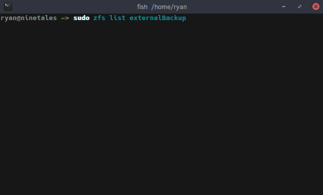

{:layout :post
:title  "ZFS Snapshot Backups to an External Drive with LUKS"
:date "2017-04-19"
:author "Ryan Himmelwright"
:tags ["Homelab" "ZFS" "Linux"]
:draft? false
}

I have had [my server](../../pages/homelab/) running [zfs](https://en.wikipedia.org/wiki/ZFS) data pools to store my data for some time now. However, I am ashamed to admit that I do not have a *true* backup system in place. I attempted to setup this system in the past, but had an issue and let it drift to the side. That changes now.

<!-- more -->


<div id="caption">Server and External Drives</div>


Currently, my server is configured with 2 main zfs mirrored pools.  The first one, `Data`, is a 2.72 TB usable pool housed on 2 x 3TB hard drives,  and contains all of my wife's and my data, organized into sub-catigory pools (ex: `Data/Music`, `Data/Pictures`, `Data/ryan`, etc). The second, `Backups`, is a 928 GB usable pool on the 2 x 1TB hard drives from my old desktop. It stores the automatic backups of some of the VMs and LXC containers on the server.

Back before I even had my 3TB drives, I bought a 2TB external hard drive to backup the 1TB drives to. While it isn't as large as the total usable space on my server, it is enough to store my data backups to, for the time being.

My plan is to setup a zfs pool on the external drive so, that I can send bi-weekly incremental snapshots to it using zfs's send & receive functions. When I am not running the backups, I want to store the drive at an off-site location. Storing the external drive elsewhere, I want to make sure the data is protected, so I will be encrypting the drive with [LUKS](https://en.wikipedia.org/wiki/Linux_Unified_Key_Setup), the Linux disk encryption software.

### Setting up LUKS

[LUKS](https://gitlab.com/cryptsetup/cryptsetup/blob/master/README.md) (Linux Unified Key Setup) is the standard for Linux disk encryption. I will use it to encrypt the external drive, and then present the LUKS mapper devices to ZFS as a block device. To do this, we need to first install `cryptsetup` with `sudo apt-get install cryptsetup` (Assuming you are on a Debian-based operating system). Once that is installed, we can setup LUKS on the drive.

The cryptsetup tool has a plethora of settings and options. After researching around, I decided use the options the author of [this post](http://www.makethenmakeinstall.com/2014/10/zfs-on-linux-with-luks-encrypted-disks/) used, because they did something very similar to what I want to do. I setup LUKS on my external drive using the following command:


```
cryptsetup luksFormat --cipher aes-xts-plain64 --key-size 512 --iter-time 10000 --use-random -y /dev/sdf
```
`--cipher aex-xts-plain64`and `--key-size 512` refer to the algorithm and key size used to encrypt the data. In general, the larger the key, the harder the encryption is to crack.

`--iter-time 10000` and `--use-random -y` are additional precautions to make it more difficult to crack the encryption. The `--iter-time 10000` means it will spend at least 10 seconds processing the passphrase each time the disk is unlocked. This makes it much harder to brute-force the passphrase. 

Once the device is encrypted, we need to unlock it and map it as a device. This is done using the command:

```
sudo cryptsetup luksOpen /dev/sdf sdf-enc
```

`/dev/sdf` is the external disk, and `sdf-enc` is whatever you want to name the unlocked device. This is the name that what will be used to when referring to the unlocked device. Now that the drive is encrypted and unlocked, it's time for some ZFS.

### Creating a ZFS Pool
I am using my single external drive, so the zpool setup is very basic. No mirrors, no zvols. A simple zpool means a simple setup command:

```
sudo zpool create externalBackup sdf-enc
```

That's it. 


### Taking the Base Snapshots


<div id="caption">Taking a ZFS snapshot</div>

With a zpool on the externalDrive, I can now start sending my snapshots to it. First, I need to create a base snapshot to send. I started with my smaller pool, `/Backups` ugh:

```
sudo zfs snapshot -r Backups@VM-LXC-BackupBase
```

This creates a recursive snapshot named `VM-LXC-BackupBase` of my `Backups` zpool. Making a base snapshot for my `/Data` zpool is essentially the same:

```
sudo zfs snapshot -r Data/DataBackupBase
```

### Sending the Base Snapshots

With base snapshots of the zpools, I can transfer them to the external drive zpool using the zfs `send` and `recv` commands. Starting with the `VM-LXC-BackupBase`:

```
sudo zfs send Backups@VM-LXC-BackupBase | sudo zfs recv externalBackup/VM-LXC-BackupBase
```
<div id="caption">Looking back I named this poorly... The external zpool should be `/externalBackup/VM-LXC-Backup`, not `BackupBase`, that name is just for the first *snapshot*. Oh well.</div>

Now for the slightly harder pool, `/Data`, and all of the sub zpools. The first time I attempted this, it had only copied the parent `Data` snapshot, and not any of the children ones (`Data/Music`, `Data/Pictures`, etc). After some digging around in the docs and online I realized I was missing the `-R` to my `zfs send` command.  Also note, that when using the `-R` flag, the snapshot name for the destination pool cannot be specified (because it is copying multiple). It will just use the same snapshot names from the source pool.

```
sudo zfs send -R Data@DataBackupBase | sudo zfs recv externalBackup/DataBackup
```

### Incremental Backups

Taking a snapshot of my data and sending it to an external drive is nice, but I don't want to send all of the data each time do a back, as it can take a very long time, especially as my data pools continue to grow. A useful feature available in zfs's `send` and `recv` commands is the ability to send *incremental* snapshots. This means that when I want to update my backups, I can just send the *changes* between the two snapshots. This is similar to [source code diffs](https://en.wikipedia.org/wiki/Diff_utility), but for file systems.

To send incremental snapshots, the `-i` or `-I` flag is used. The difference between the two is the `-i` flag will send the difference between the two snapshots listed, whereas `-I` can send a series of snapshots between the two list. For example, if I've taken several snapshots of my data (`A`, `B`, `C`, and `D`), but neglected to copy them to my external drive since snapshot `A`, I can use `-I A D` in my `zfs send` command, and all four of the snapshots will be sent to the external.

To send an incremental update to my backup, I first created new snapshot for my pools (this time with a date):

```
sudo zfs snapshot -R Backups@VM-LXC-Backup20170418
sudo zfs snapshot -R Data@DataBackup20170418
```

Next, I sent the incremental changes between the new snapshots, and the base ones I originally made, to my external hard drive pool:

```
sudo zfs send -R -i Backups@VM-LXC-BackupBase Backups@VM-LXC-Backup20170418 | sudo zfs recv externalBackup/VM-LXC-BackupBase
sudo zfs send -R -i Data@DataBackupBase Data@DataBackup20170418 | sudo zfs recv externalBackup/DataBackup
```


Notice that I specify *two* snapshots in the send command, to define the range of differences to send. 

##### A Minor Issue
When I first tried sending my incremental backup, I had a minor issue. ZFS gave me an error saying that my destination had been changed since last snapshot (meaning the base snapshot on the externalBackup pool). I looked this up online and it appears that sometimes, just looking around the pool can change files. Some people recommended setting the destination pool to read-only, so I did it to my backup pool:

```
sudo zfs set readonly=on externalBackup
```

I am not sure if this will mitigate this problem in the future, but time will tell.

I still had the error when sending, so I added the `-F` flag to the `zfs recv` command. I am not sure if this was the *best* solution, but it seemed to be okay. I also thought about rolling back to the snapshot, and then copying which is likely a safer method (if you don't mind losing the "changes" on the destination pool).

### Safely Closing and Removing the External Drive



When the incremental backup has finished transferring, the external drive can be removed. The sequence of steps to do this are 1) export the zpool 2) close the LUKS device, and 3) unplug the drive. To export the zpool:


```
sudo zpool export externalBackup
```

### Summary
