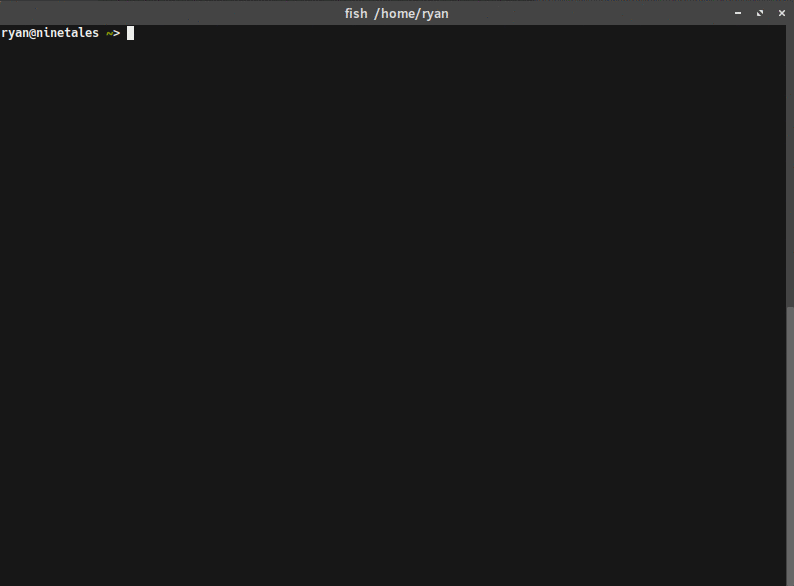
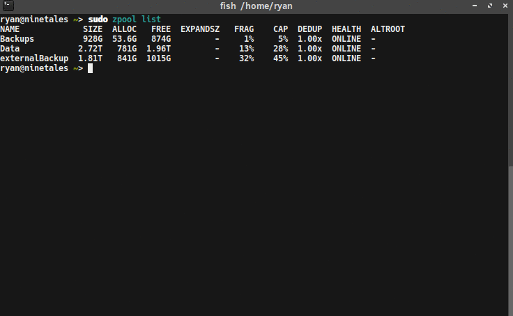

{:layout :post
:title  "ZFS Snapshot Backups to an External Drive with LUKS"
:date "2017-04-20"
:author "Ryan Himmelwright"
:tags ["Homelab" "ZFS" "Linux"]
:draft? false
}

I have been using [ZFS](https://en.wikipedia.org/wiki/ZFS) data pools to store data on [my server](../../pages/homelab/#ninetales) for some time now. As great as that is, I am ashamed to admit that I have not had a *true* backup system in place (raid/mirrors are not backup). I have a backup solution that I have attempted in the past, but ran into an issue and let it drift to the side. That changes now. It's time to revisit my solution, and complete it to the end.

<!-- more -->


<div id="caption">My server's hot-swap drive bays and the external backup drive</div>


Currently, my server is configured with two main zfs mirrored pools. The first one, `Data`, is built on 2 x 3TB hard drives, providing 2.72 TB of usable disk space. It contains all of my wife's and my data, organized into sub-category pools (ex: `Data/Music`, `Data/Pictures`, `Data/ryan`, etc). The second, `Backups`, is built on the 2 x 1TB hard drives from my old desktop, creating a 928 GB usable pool . It stores the automatic backups of some of the VMs and LXC containers hosted on the server.

Before I had my 3TB drives, I bought a 2TB external hard drive to backup the 1TB drives to. While it isn't as large as the total usable space on my server, it is enough to store my data backups to, for the time being.

My goal is to setup a zfs pool on the external drive, so I can use zfs's send & receive functionality to send bi-weekly-ish incremental snapshots to it. When I am not running backups, I want to store the drive at an off-site location. With the drive being stored elsewhere, I want to ensure that the data is protected, so I will be encrypting the it using [LUKS](https://en.wikipedia.org/wiki/Linux_Unified_Key_Setup), the Linux disk encryption software.

### Setting up LUKS

[LUKS](https://gitlab.com/cryptsetup/cryptsetup/blob/master/README.md) (Linux Unified Key Setup) is the standard for Linux disk encryption. I will use it to encrypt the external drive, and then present the LUKS mapper devices to ZFS as a block device. To do this, we need to first install `cryptsetup` with `sudo apt-get install cryptsetup` (Assuming you are on a Debian-based operating system). Once that is installed, we can use the `cryptsetup` command to configure LUKS on the drive.

The cryptsetup tool has a plethora of settings and options. After researching around, I decided to use options that the author of [this post](http://www.makethenmakeinstall.com/2014/10/zfs-on-linux-with-luks-encrypted-disks/) used, because they were doing something very similar to what I am trying. I configured LUKS on my external drive using the following command:


```
cryptsetup luksFormat --cipher aes-xts-plain64 --key-size 512 --iter-time 10000 --use-random -y /dev/sdf
```
`--cipher aex-xts-plain64`and `--key-size 512` refer to the algorithm and key size used to encrypt the data. In general, the larger the key, the harder the encryption is to crack.

`--iter-time 10000` and `--use-random -y` are additional precautions to make it more difficult to crack the encryption. The `--iter-time 10000` means it will spend at least 10 seconds processing the passphrase each time the disk is unlocked. This makes it much harder to brute-force the passphrase. 

Once the device is encrypted, we need to unlock it and map it as a device. This is done using the command:

```
sudo cryptsetup luksOpen /dev/sdf sdf-enc
```

`/dev/sdf` is the external disk, and `sdf-enc` is whatever you want to name the unlocked device. This is the name that what will be used when referring to the unlocked device. With the drive is encrypted and unlocked, it's time for some ZFS magic.

### Creating a ZFS Pool

I am creating a zpool using just my single external drive, so the setup is very basic. No mirrors, no zvols. A simple zpool is created with the simple command:

```
sudo zpool create externalBackup sdf-enc
```

That's it. 


### Taking Base Snapshots


<div id="caption">Taking a ZFS snapshot</div>

With a zpool initialized on the externalDrive, I can now send snapshots to it. To start, I created a base snapshot to send. Starting with the smaller pool, `/Backups`:

```
sudo zfs snapshot -r Backups@VM-LXC-BackupBase
```

This command creates a recursive snapshot of my `Backups` zpool, named `VM-LXC-BackupBase`. Making a base snapshot for my `/Data` zpool is nearly the same:

```
sudo zfs snapshot -r Data/DataBackupBase
```

### Sending the Base Snapshots

After taking base snapshots of the zpools, I can transfer them to the external drive using the zfs `send` and `recv` commands. Again, starting with the `VM-LXC-BackupBase`:

```
sudo zfs send Backups@VM-LXC-BackupBase | sudo zfs recv externalBackup/VM-LXC-BackupBase
```
<div id="caption">Looking back, I realized I named this poorly... The external zpool should be `/externalBackup/VM-LXC-Backup`, not `BackupBase`, that name is just for the first *snapshot*. Oh well.</div>

Now for the slightly harder pool, `/Data`, with all of the sub zpools. The first time I attempted this, only the parent `Data` snapshot was copied, but none of the children were (`Data/Music`, `Data/Pictures`, etc). After some digging around the docs and online I realized I was missing the `-R` to my `zfs send` command.  Also note, that when using the `-R` flag, the snapshot name for the destination pool are not specified (because it is copying multiple). It will use the same snapshot names from the source pool.

```
sudo zfs send -R Data@DataBackupBase | sudo zfs recv externalBackup/DataBackup
```

### Incremental Backups

Taking a snapshot of my data and sending it to an external drive is nice, but I don't want to send all of the data each time I backup. Transferring can take a very long time, especially as my data pools continue to grow. I don't want to sit around all day, listening to hard drives hum as my data transfers.

<center></center>

A useful feature of the zfs `send` and `recv` commands is the ability to send *incremental* snapshots. This means when I want to update my backups, I can just send the *changes* between the two snapshots. This is similar to [source code diffs](https://en.wikipedia.org/wiki/Diff_utility), but for file systems.

To send incremental snapshots, the `-i` or `-I` flag is used. The difference between the two is that the `-i` flag will send the difference between the two snapshots listed, whereas `-I` will send a series of snapshots between the two listed. For example, if I've taken several snapshots of my data (`A`, `B`, `C`, and `D`), but have neglected to copy them to the external drive since snapshot `A`, I can use `-I A D` in my `zfs send` command, and all four of the snapshots will be sent to the external.

To send an incremental update to my backup, I first created new snapshot for my pools (this time with a date):

```
sudo zfs snapshot -r Backups@VM-LXC-Backup20170418
sudo zfs snapshot -r Data@DataBackup20170418
```

Next, I sent the incremental changes between the base snapshots, and new ones I just made:

```
sudo zfs send -R -i Backups@VM-LXC-BackupBase Backups@VM-LXC-Backup20170418 | sudo zfs recv externalBackup/VM-LXC-BackupBase
sudo zfs send -R -i Data@DataBackupBase Data@DataBackup20170418 | sudo zfs recv externalBackup/DataBackup
```


Notice that I specify *two* snapshots in the send command, to define the range of differences to send. 

#### A Minor Issue

The first time I tried sending an incremental backup, I encountered a minor issue. ZFS gave me an error stating that my destination had been changed since last snapshot (meaning the base snapshot on the externalBackup pool). I looked this up online and it seems that sometimes, just looking around the pool can change files. Some people recommended setting the destination pool to read-only, so I did that to my backup pool with:

```
sudo zfs set readonly=on externalBackup
```

I am not sure if this will eliminate this problem in the future, but I guess I will find out.

I still had the error when sending, so I added the `-F` flag to the `zfs recv` command. I am not sure if this was the *best* solution, but it seemed to be okay. I also thought about rolling back to the snapshot, and then copying which is likely a safer method (if you don't mind losing the "changes" on the destination pool).

### Safely Closing and Removing the External Drive


<div id="caption">Exporting the zpool and closing the LUKS device</div>

When the incremental backups finishes transferring, the external drive can be removed. The sequence of steps to do this safely are 1) export the zpool 2) close the LUKS device, and 3) unplug the drive. To export the zpool and close the LUKS device I used the commands:


```
sudo zpool export externalBackup
sudo cryptSetup luksClose sdf-enc
```

After that, I was able to unplug the external drive, and store it in a safe location, until I need to backup data to it again.

#### Opening and Importing zpool for Recurring Backups


### Summary
I am happy with this solution for now. It allows me to leverage ZFS a bit more, and become more familiar with it. The biggest issue I will likely face is space on the external drive. Luckily, ZFS makes it easy to delete old snapshots. In the future, I might also consider using an online backup solution like [Tarsnap](https://www.tarsnap.com/), but I need to find a cost-effective one first. I'll be sure to update as I continue to expand my backup solution.
