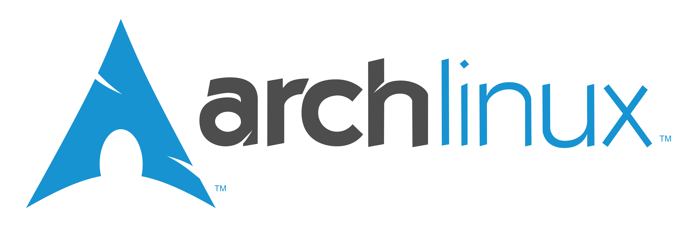
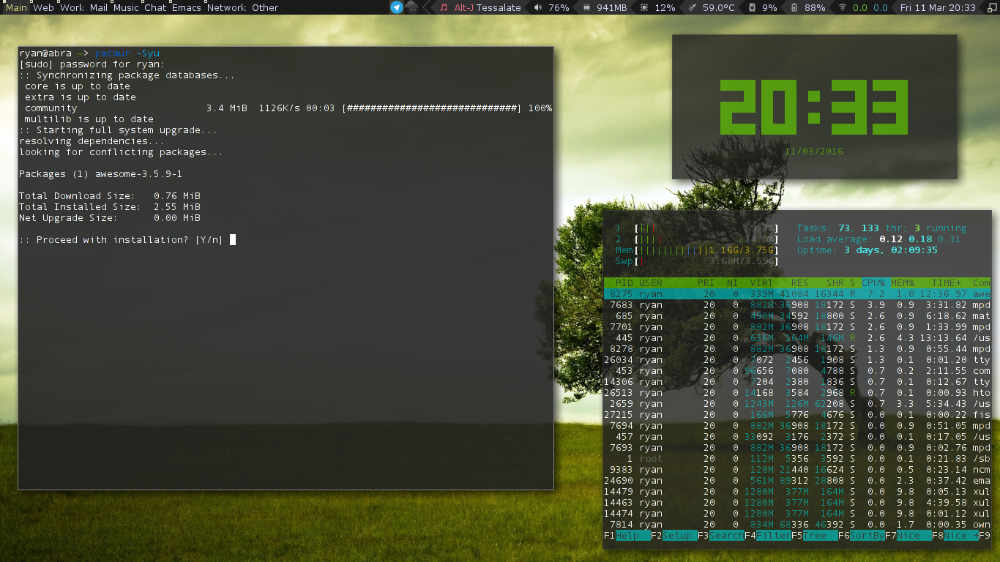

{:title  "Back On Arch, After Frantic Distro-hopping"
:layout :post
:date "2016-03-13"
:author "Ryan Himmelwright"
:tags ["Linux" "Arch Linux"]}

In the last few weeks, I have started my CS masters classes, and needed to setup a productive work environment on my portable laptop ([abra](../../homelab)). Also, while I love Fedora, the Nvidia stuff was being a pain on my main computer ([alakazam](../../homelab)), and I was looking for a replacement there as well. So, after a long, drawn out battle trying nearly all of my favorite Linux distros, I have found myself once again using [Arch Linux](https://www.archlinux.org/) on both of my personal computers.

<!--more-->

## From Fedora...

When I started my journey, I had Fedora on both of my computers. I really like the [Fedora Project](https://www.getfedora.org) and I think Fedora is a great distribution with a lot of innovative new features. I seems that the Fedora Project is aiming to be the Linux Distro for developers, and I feel that they are really starting to hit that target.

There is one remaining big issue I had while running Fedora on my main computer. Nvidia drivers. They are just a pain to maintain, and kept breaking my system during updates. I know the [RPM Fusion Repos](http://rpmfusion.org/) are supposed to help, but they just aren't there yet. With my classes starting, I needed something that was a bit more stable (and would hopefully support installing VMWare Workstation 9).

## The 'Easy Stability' of Ubuntu-based? 

Guided by desires to have a "stable" distro, I decided that the *obvious* answer would be to use an [Ubuntu](http://www.ubuntu.com/)-based distro. So, I went with [Ubuntu Mate](https://ubuntu-mate.org/), based on the _awesome_ work the team has done recently. I've used Ubuntu Mate in the past on several different computers, and in fact, still have it running on [charmander](../../homelab/). I had some issues installing Ubuntu Mate on alakazam for some reason, but using a simple `nomodeset` at boot seemed work.

After I got it installed, I was able to install the nvidia drivers, but I had other random issues here and there. I also tried installing VMWare, but had issues at every step. To be completely honest, I really wasn't feeling using an Ubuntu distro on alakazam. If I was going to be replacing Fedora, I wanted to make up for it by using something that gave me more power (I've started to get the itch to try out Gentoo again. Spoiler, I am not using Gentoo. At least until my class is over...). While Ubuntu could easily support my needs being the well supported and advanced distro that it is ... I craved something else.

## Leaping to Suse?

During my last few months on Fedora, I took notice of another rpm distro that was  making noise in the Linux community: [OpenSuse](https://www.opensuse.org/). Specifically, the new [OpenSuse Leap](https://software.opensuse.org/421/en) piqued my interest. I had played with it in a VM a few days earlier and liked what I saw. The OpenSuse installer along with the YaST configuration tool makes it _stupid easy_ to setup powerful and advanced features in Linux. Want to setup a KVM virtualization environment or a samba share? You basically just have to click a button. Testing out [Snapper](https://en.opensuse.org/Portal:Snapper) was also slick. I wish more distributions would start to include tools like snapper, built in.

Leap was a solid and extensive distribution. Ultimately though, that was the biggest qualm I had with it: there was a lot going on. I did not know what many of the pre-installed configuration tools were. Normally, I am fine with learning new tools, but I wanted a distribution that I could set up and get to work. OpenSuse had _too many_ "toys" already in it. I would not be able to resist spending hours learning everything. Ironically, my other complaint was that some of the applications I _did_ want, were not easily available. Often, they were not included in the default repositories, and while many application websites will provide a *.deb download, *.rpms are a bit more scarce. I know there is the wonderful [openSuse Build Service](https://build.opensuse.org/), but like [Fedora's copr build system](https://copr.fedorainfracloud.org/), I often found it to be hit or miss. Both do a good job at addressing a major issue in their respective distributions, but neither isn't quite to the level of ... well, the [AUR](https://aur.archlinux.org/).

## Antegeros

Which brings me to [Antergos](https://antergos.com/). By this point, I was no longer able to hide the fact that I was starting to severely miss many features a distribution like [Arch Linux](https://www.archlinux.org/) provides. I love that you can easily customize just about _anything_. I also appreciate that if I want to try something new, 99% of the time the latest version is already in the official repos or the [AUR](https://aur.archlinux.org/). Additionally, when I am trying a new application, or customizing my setup, the [Arch Wiki](https://wiki.archlinux.org/) has some of _the best documentation_ in the Linux ecosystem. However, I wanted something that I could just install and have working. I didn't feel like going through a full vanilla Arch install. So I installed Antergos. Antergos has a simple but thorough installer that pulls down all the latest packages during the installation. This leaves the user with an up-to-date and _gorgeous_ setup after installation.

Unfortunately, the "simplicity" of Antergos (which is sort of the antithesis to the definition of _simplicity_ in [The Arch Way](https://wiki.archlinux.org/index.php/Arch_Linux#Simplicity)) always seems to bite me in the end. Eventually, _something_ breaks, and I have a hard time figuring out _what_. While it might be a pain to install _everything_ in vanilla Arch, the user _"has a much fuller understanding of his or her system_" as a result. A few years ago, when I first started using Arch, I thought this argument just stupid gray beard nonsense. Now, I appreciate the benefits of this sentiment, and even agree with it (I've also learned to [script](https://github.com/himmAllRight/dotfiles/blob/master/archInstallScript.sh) my post install process, so it is less of a pain :P).

After a few days of fighting with Antegeros, I decided to just bite the bullet and install Vanilla Arch. I still think Antegros is a great distribution that works for a bunch of people. It is great for users that want to experience the power of arch Linux, without having to go through all the overhead. Antegeros is actually how I started to learn Arch Linux. Nowadays though, I seem to prefer _simplicity_ of vanilla Arch. 

## All Roads Lead to Arch

I have been running Arch on both of my personal laptops for several weeks now. Arch doesn't magically solve all of my issues, but it makes _fixing_ them much easier. If something isn't working, the combination of the wiki and the community make the problem _much_ more approachable. Additionally, the rolling release model appears to mitigate bug-related issues, instead of cause them. For example, I installed Arch on alakazam first, but left Ubuntu Mate on abra (my portable laptop). I did this because my school has a weird network setup that is often difficult to connect to. After searching for hours, I determined that my issues under Ubuntu were caused by a known, but unfixed, bug in my version of network manager. I did not feel like dealing with this, so I installed arch. My internet at school works works fine now. I was able to use the wiki to properly configure my settings, and I was good to go. (Side-note: I never fully got VMWare 9 to work properly on any of my distros, but I came closest with Arch.)

*Abra running Arch Linux with the [Awesome](http://awesome.naquadah.org/) window manager*

Being back on arch has been great. I love using tiling window managers like i3, dwm, xmonad, stumpwm, and awesome. While this this is possible on all distributions, it is much easier on arch. Starting with a blank slate, and (again) having the wiki makes setting up alternative desktop environments and window managers a breeze. I now have a _very_ productive work environment that is tailored to my needs. While Arch Linux might not be a traditional "stable" distribution, I have found it to be much more durable for my use-case.

I am planning to stay on Arch for awhile. That being said, I really did enjoy all the other distributions I tried out. Each one seems to be carving out a niche in the Linux environment:

- Fedora is becoming a great distribution for Linux developers. In fact, I still have Fedora 23 (Server Edition) running on my home server. Assuming that the upgrade to 24 goes smoothly (my upgrade from 22 -> 23 went great, thanks to [dnf](https://fedoraproject.org/wiki/Features/DNF)), I see no reason to switch.

- OpenSuse Leap is a solid distribution that is great for power users that want a turn-key distribution with all the bells and whistles. I think it is especially geared toward people with system administration backgrounds.

- Ubuntu Mate is really the best distribution out there for people that want a classic feeling Linux environment, with a modern flair. It is what Ubuntu would be if it never left gnome 2. It is also great for low resource hardware, particularly boards like the [raspberry pi](https://www.raspberrypi.org/).

- Antegros is fantastic for Arch users that hate the Arch install. It is also great for people that want to move to Arch, but aren't yet comfortable with tools like pacman.

It is great to see all the distributions finally finding their groove. This isn't something I could say about Linux 2 years ago. As I have already stated, I plan to stay on Arch Linux for the time being, but I am very excited to continue trying out the new releases of the all distributions listed above. With so many great options, it really is a great time to be a Linux user :) .

