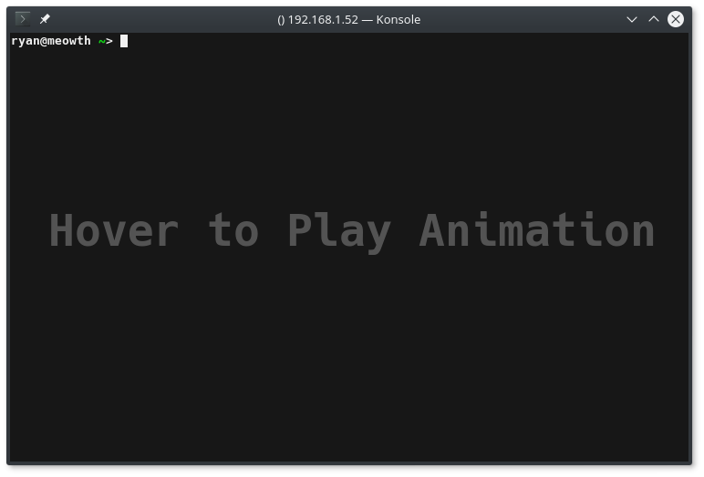

{:layout :post
:title  "Creating a git Repo Remote"
:date "2017-07-18"
:author "Ryan Himmelwright"
:tags ["git" "Linux" "dev"]
:draft? false
}

I've been meaning to move my password-store repo to be just a simple self hosted
on. I don't need gitlab for all that. For as simple as the basic solution is,
all the guides I saw online went above and beyond what to do. It's like, 2 steps
so I'll quickly post them here.

<!-- more -->

### SSH Keys
The first (somewhat optional) step to is to setup ssh key authentication. If ssh keys are not configured, git will prompt you for the password of whichever user the git repo is hosted under. When using a git service (ex: Github or Gitlab), this often is often unknown, so ssh keys are required. When rolling your own remote git repo, the password will likely be known. Still, setting up ssh authentication makes the process easier and more secure. If you
do not know how to configure ssh keys, I included a small ssh key how-to [here](../Ansible-On-Pi-Cluster#ssh) in [a previous post](../Ansible-On-Pi-Cluster). Many of the git guides out there call for creating up a `git` user and setting up ssh keys for that user. This is a good idea if multiple people need access to the git repo, but for my purposes, I am the only one ever accessing it (Which is a good thing, since it's my password vault). 

### Creating Server Repo

<center>
 
</center>
<div id="caption">Creating the remote git repo</div>

Once ssh authentication is configured, ssh into the remote server to host the git repository. Creating the actual repo is very simple. First, make a directory for the repo (convention is REPO-NAME.git). Next, jump into the created directory (`cd`) and run the command `git init --bare`. The to full sequence I used:

```
mkdir REPO-NAME.git
cd REPO-NAME.git
git init --bare
```


This will initialize the repository inside that directory. The `git init` command is used to create any git repository. The `--bare` option tells git to treat it as a bare repository. Bare repositories contain no working or checked out copy of the source files. Thus, plain `git init` command creates a *working* repo, while `git init --bare` is used to create a *sharing(server) repo*. The working repositories of many developers can be synced to the server repo. Setting up a remote sharing repo is what this post is all about.


### Pointing Local Repo to Server
Once the remote repo is initalized, we can point an existing git repository on the local machiene to it. To do this, enter the directory of the git repository, and edit the config the (`.git/config`). To redirect the repo to point to the new remote, edit the `url` line to the location of the repo:

`username@hostname:reponame`

```
cd Server-Node-Files
vim ./git/config
```


