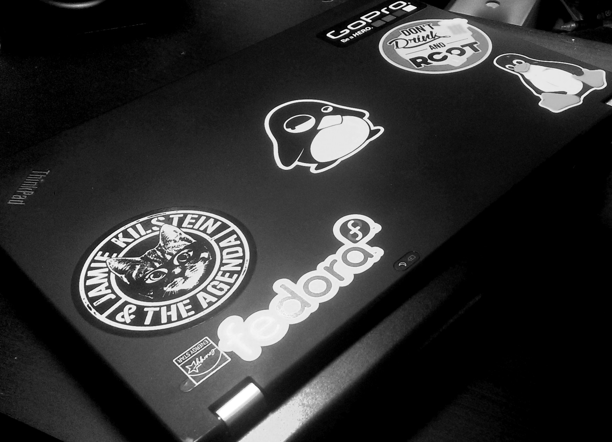

{:layout :post
:title  "Introducing Kadabra - My New, Used x230"
:date "2016-11-29"
:author "Ryan Himmelwright"
:tags ["Linux" "Korora" "Thinkpad"]
;:draft? true
}

As I start to do more with a computer on the go, the netbooks I was
using just weren't cutting it anymore. They were great for minimal
use, but over-heated, couldn't run VMs, and didn't even have great
battery life. Now that I am starting to go to the library daily to
work through personal and open source projects, I really needed a better
mobile pc setup. 

<!-- more -->

### Other Considerations 

I've been keeping an eye open for a new mobile computer for over a
year now. I mostly looked sub $300 ubuntu laptops like the Asus 11" 
celeron (x201e, ubuntu version) I got in college. I determined that I didn't need much HD
space on my portable computer, because I usually only have a minimal
OS, my projects (which are git controlled), and sometimes a 
_little bit_ of music. Even with dropping my requirements to computers with
_very tiny_ HDs (often < 60GB), none of the options seemed great. They
usually had Celeron processors, and little ram. Even worse, they
weren't easily expandable. I also briefly entertained the idea of
putting Linux on a chrombook, but they had the same issues that all
the other sub $300 options had.

### Used Thinkpads

When I started amp up my search, I started to consider other
options. One of these alternatives is very popular among Linux users,
but I always seem to forget about it when looking for a new
device. This option of course is buying a used Thinkpad and installing
Linux on it. This seemed like a great time to try this option out. I
don't mind if there is a scratch or two on the device. This is my
portable computer after all, so I'm sure a new device wouldn't stay
pristine for long anyway. So, I started researching used Thinkpads and
loved how much you got for your money. I could get i5 devices with a
good bit of ram and okay hard drives for under that $300 price
point. Better yet, it seemed super easy to upgrade all of the models I
looked at. So, even if the device had a bad battery, or needed a
RAM/HD upgrade, I _could could do it_. 

I eventually narrowed my search down to the X230 or T430s. That year's
model seemed like the perfect mix of still being relatively new, but
still being old enough that many business had started to replace
them, flooding the used market and driving the cost down. They also
didn't have the terrible track pad that the x240 and T440s had. I
eventually decided on the x230 because the main drive to get this
laptop was that I needed a new  portable computer.

### This Particular Thinkpad x230 ...

I found my used x230 on Amazon, for about $185. It seemed to be in
okay shape in the pictures, and the specs were good for the price:
- Intel i5-3320M
- 4 GB RAM
- 12.5" 1366x768 HD LED Display
- 320 GB HHD

It also listed that it came with a "used 6-cell battery". So I planned
from the beginning to have it replaced. Sure enough, the battery was
completely dead when I got the laptop. If I unplugged it, it
shutdown. So, I ordered a 9-cell battery online to replace it. I added
a 4GB RAM stick I took from an older laptop, and replaced the slow HHD
(with Windows pre-installed), with a cheap 120GB SSD I had lying
around. After installing Korora 24 on the new SSD, I suddenly had a
nice, portable computer that only cost me about $200 (plus some spare
parts). As advertised, swapping the battery, adding RAM, and replacing
the HD were _super simple_ and _accessible_.

### What I like about it
- **Track point** - I love track points. Using other laptops with
  trackpads is really frustrating now. I completely understand now why
  people are so crazy about them.
- **Keyboard** - They keyboard really is great. I feels solid and not like
  other laptop keyboards. It is very nice to type on. I know many
  people hate this model because they changed the keyboard from the
  older models like the x220, but I still think the x230 has a great
  keyboard.
- **Physical buttons** - The x230 has physical mute, volume control, and
  mic buttons. This is a feature I enjoy much more than I thought I
  would.
- **Upgradability** - As I have already mentioned, it is _very_ easy
  to upgrade the x230. Right when I got it, I replaced the HHD with an
  SSD and added another stick of RAM, doubling the total in under five
  minutes. In fact, I have simply swapped the SSD out temporarily with
  a second one several times now to try out different distros on real
  hardware. It's just so easy to do.
- **Feel** - I really like how this laptop feels. I've already
  mentioned that I enjoy the solidness of the keyboard, but I also
  love the texture of exterier of the case. It has a slight rubbery
  feel to it that makes it easy to hold.
- **Bang for your buck** - I think getting a used thinkpad really is a
  great deal. Even counting the minor upgrades I installed, I was able
  to get _an actual computer_ for around the same price as many
  _netbook_ alternatives I was looking at.
- **Size** - This is my mobile computer, so I need it to be
  small. While it isn't as thin as my wife's macbook air, it is still
  very portable. I actually don't mind it being a little bit thicker,
  as I find it to be the perfect size to hold and carry around. It is
  a similar size to a few of my programming books and slide into my
  backpack very easily.

### What I don't like
- **Has a little bit of flex** - While the laptop overall feels pretty
  solid, the screen does have a bit of flex when pressed.
- **Resolution** - I really hate 1366x768 on laptops. I don't even need 1920x1080. It would be very tiny on a 12.5" screen. 1600x900 however...
- **Track pad (but honestly who cares)** - The trackpad isn't great. In fact, it can be downright annoying. The bottom of the trackpad curves around the edge of computer, which looks nice, but rubs against my stomach when I am working with the laptop on my lap. This causes the cursor to fly around and do everything but what I want it to do. This would be a much bigger issue on other laptops, but with howmuch I use the track point, I could care less. I usually disable the trackpad alltogether.
- **Speakers aren't great (but again, not a bit deal)** - The speakers are very quiet and don't sound very good. This isn't a huge deal for me because this is my mobile computer, which means I am using headphone 99% of the time with it. Still, it would be nice if when I occasionally share a video with someone they could actually hear it.

### Conclusions

I have had Kadabra it for months now and still love it. I use it at work daily. It is a perfect mix of being nice and portable while still having enough power to accomplish whatever I want to work on. While I still prefer to vote with my wallet by purchasing from a vendors like [System76](http://www.system76.com) when possible, buying used business hardware, such as thinkpads, is a very affordable alternative. I have no regrets buying my used x230. It is infinetly better than my other options at that price point.

### Update
_I have taken so long to publish this post, I am actually now using Arch Linux on Kadabra. It also runs great :)_
