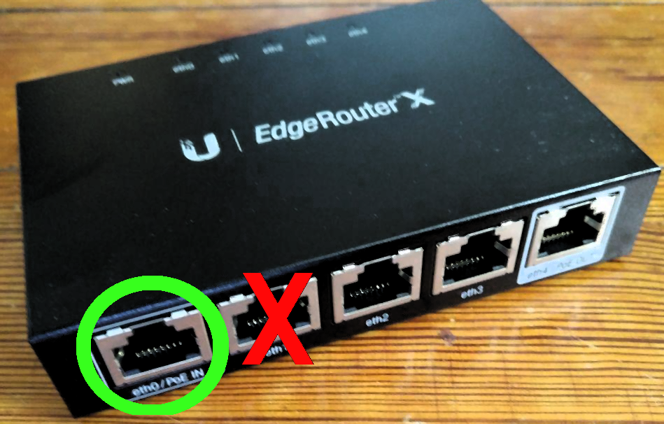

{:layout :post
:title  "Encountered Issues Setting Up Ubiquiti Network"
:date "2017-06-29"
:author "Ryan Himmelwright"
:tags ["Homelab" "Network" "ubiquiti" "wifi"]
:draft? false
}

This past weekend, I setup my new ubiquiti network. It actually took up a good
portion of Sunday, because I ran into a few minor issues.
Fortunately/Unfortunately, these issues were mostly because it my first time
configuring this type of setup, so there was a lot of trial and error. The basic
setup is now all configuring and has been running great. It was a good day and I
learned a lot :). In fact, I am confident that if I had to start over from
scratch, the process would take me about 10-15 minutes. Just to be sure, I'm
just going to quickly jot down the major pain points I had during the initial
setup.

<!-- more -->

## Trouble Connecting to the EdgeRouter-x for Initial Setup
<center>

</center>
<div id="caption">During initial setup, I was connecting the router wrong</div>

The edgerouter needs to be directly connected to a computer during its initial
setup, so that the EdgeOS configuration screen can be accessed. The
instructions clearly stated to connect and ethernet cable from my laptop to the
`eth0/POE` port on the edgerouter, but I guess I didn't believe them.


Instead, I plugged the ethernet cable from my modem into `eth0`, and my computer
to `eth1`. That didn't work. However, once I *properly* connected the devices (and
manually set a static IP on my laptop, `192.168.1.2` for example), I was able to access
the configuration page in my browser via `https://192.168.1.1` (don't forget
the *s* in *https*). Lesson Learned: manuals are (*usually*) not out to get you.

## Issues connecting AP/POE
This was not actually an issue I encountered, but rather me not being sure what
the best way to setup the [POE](https://en.wikipedia.org/wiki/Power_over_Ethernet) 
was. At first, I had the POE adaptor connected between the edgerouter and the
AP, because I wasn't sure if it could power both devices with it. I eventually 
found a 
[great guide](https://www.youtube.com/watch?v=f7FeYsJqotc&list=PLDBkup9c8YMgZaE50hAjP7rbbVriTlyQf&index=1)  that confirmed that I could.

<p>
```
Modem  --
        |
         --> POE Adaptor --> (*eth0*)  edgerouter-x  (*eth4*) --> AP Lite
        |
Power  --
```
<div id="caption">Digram describing the correct link up</div>
</p>

Once I swapped that that all around, I just had to go into the router
configuration and enable the POE for eth4, and the AP lit up, indicating that it
was connected and being powered.

## Issues linking/configuring the AP
This was the I spent the most time on. I knew I had to setup the configuration
software, but the Linux binary was a .deb, and I have been running Solus. So, I
spun up a few VMs on my laptop to try it out, because I didn't feel like
packaging it up for Solus yet, and I thought it was a normal GUI application.
However, I over looked the fact that my laptop VMs default to a different
subnet. I was hoping that because the VM's network was routed through my laptop,
which was connected directly to the edgerouter, it would still be able to see
the access point. However... the AP couldn't see the VM which was the issue. The
AP wasn't being detected. Eventually, I admitted it was likely due to the
192.168.122.* ip that the VM was assigned.

<center>


</center>
<div id="caption">I spun up a new Ubuntu VM (Venomoth) to host the Ubifi controller</div>

By this point, I also had learned that the software is more of a server service,
than a GUI desktop application. So, I decided spinning up a dedicated VM on my
server to host the wifi controller might be worth it. Virtual machines on my
server automatically get configured on the main subnet, so it also fixed my
issue. This setup made more sense anyway, because now I can always connect to
the AP controller, just like my router's settings webUI.


That's it for setup "*issues*". There were no *major* issues, just little
confusions for a Ubiquiti/POE first-timer. Like I stated earlier, I am sure I
could redo the setup in about 15 minutes with now issues... 10 now that I
recorded everything in the post!
