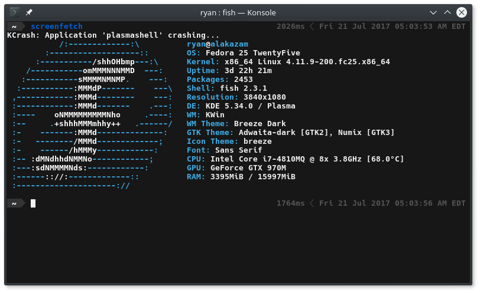
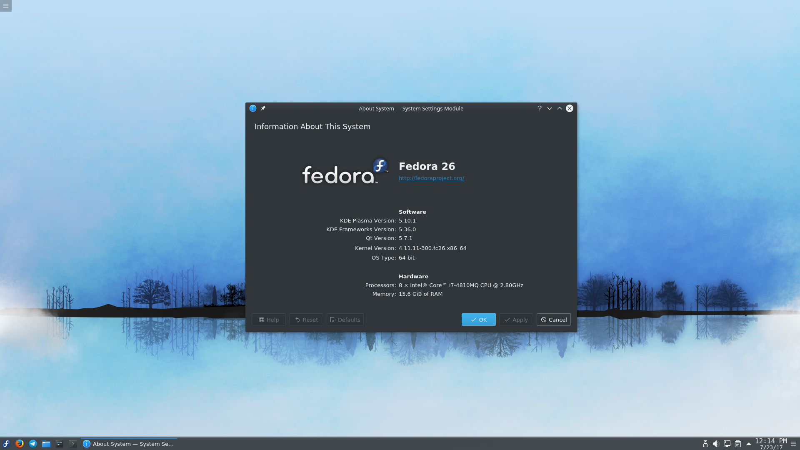

{:layout :post
:title  "Migrating from Solus to Fedora for a bit"
:date "2017-07-21"
:author "Ryan Himmelwright"
:tags ["Linux" "Fedora"]
:draft? false
}

For awhile now, I have been debating the idea of switching back to Fedora (from Solus). Well, at least on my [main computer](../../pages/homelab/#alakazam). First, let me state this right up front: I am still *very* satisfied with Solus. I think it is one of the best current Linux distros, and I want to still contribute to the project. However, there are a few reasons why Solus isn't the best fit for my needs right now, and I will highlight them below.

<!-- more -->

### Why Switch

The Solus (Left) and Fedora (right) Project Logos

On the [Solus Project homepage](https://solus-project.com), it states right away that "Solus is an operating system that is designed for **home computing**." While I am talking about my *home* computer, the tasks I am doing with it do not fall into your standard *home computing* use. Recently, the top computing activities I've been doing are:

- Writting (okay... but still)
- Running *lots* of VMs
- Trying various Server Technologies
  - ZFS
  - KVM
  - Containerization (LXC, Docker, ...)
  - Ansible and other automation tools
  - Etc.
- Learning about Clustering
  - OpenMP
  - High Availability
- Trying to get involved with some other Open Source Projects
  - Fedora (Infrastructure, Dev)
  - NixOS

As you can see, many of the activities I'm doing aren't desktop based, but 
really *server* based. And Solus is *not* a server distribution, as it doesn't 
*try* to be one.

Main reasons are it just might make sense for what I am trying to do on my
computers these days. Solus is great for our standard desktop user or even Dev.
I'm reall not full using that workflow right now though. The main things I've
been doing are:

Additionally, I've been eyeing up the Plasma desktop, and wanted to try that out again (Solus doesn't currently support Plasma... *yet*).

### Solus is still great

Solus is a great desktop OS, but I am trying to get more experience with server
type distros... which makes me think working in a Fedora environment and using
that to build up to also switching my Server to CentOS might be a better deal
for me... for now.

The main issue is that I still do want to be a part of the Solus community and
Dev there...

Maybe I could switch Alakazam to Fedora, and keep Kadabra on Solus, with the
Fedora dev VM?

IDK... I have to see. Also need to get remote Virt-manager working....

I'll think about all of this...

### The Switch

Screenfetch on my new Fedora Install

Well... I did it. I switched to Fedora on Alakazam yesterday. I went with the Fedora 25 KDE spin
and did all of the hoops to get that up and going. Not only am I getting used to Fedora gain, but
I am also finding myself having to get used to the KDE environment again... it does seem different
that other Plasma setups I've used in the past...

I am actually writting this ssh'd into Alakazam from Kadabra because it has none of it's apps...
because I am actually in a live environment of the Fedora 25 KDE spin here as well. I am doing it on
my test SSD, but will likely switch over to my perminent drive soon. I wanted to leave Solus on it,
but the network stuff kept dropping after suspend, as in it didn't even display available wireless
connections. Not good.

The update is done so I'm going to restart and get this running.

Alakazam is doing well on Fedora. I've been enjoying it a bit and think I might
stay on it. I am not sure about Kadabra's fate though. I am pretty sure that the
wifi stuff is due to Intel. Also, I've been experimenting with nixos again... so there's that...

### Update

#### Kernel Upgrade
So I am about to do my first Kernel update since being on Fedora again (on
Alakazam). We'll see how the video drives stuff is... To note, I am still on 25
so it hopefully won't be too bad...

No issues whatsover :)

#### Upgrade to Fedora 26

I upgrade my Fedora 25 Plasma Install to Fedora 26

I just upgraded Alakazam from Fedora 25 KDE, to Fedora 26 this morning. I couldn't really get the
graphical installer to start, but that could be because I have several desktop environments setup
(Plasma & Gnome), so it was confused. 

I just did the upgrade using the command line dnf upgrade tool like I normally use, and it worked
wondefully. It even looks like my nvidia drivers and everything stayed and were configured correctly
after rebooting. The only difference is I don't seem to have the same Plasma animations I had
before, but that is fine. 
