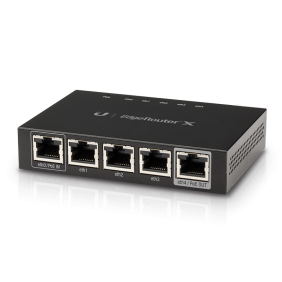

{:layout :post
:title  "Upgrading Home Network to Ubiquity Edgerouter and AP"
:date "2017-06-15"
:author "Ryan Himmelwright"
:tags ["Homelab" "Network" "ubiquiti" "wifi"]
:draft? false
}

While I was away for a week to attend my College Swim team Reunion, and my
Brother's high school graduation, the router Rebecca and I were using died. When
I returned, I setup our old router as a *temporary* fix. It is terrible. So, I
have started researching what I should upgrade our network with. This time
around, I am doing it the correct way.

<!-- more -->

It
was a Lynksys WRT 1900. When I got home, I setup our old router as a temporary
fix. It's a very basic Lynksys E1200. After using it for a day, I remember why I
hated it so much. It is terribly slow, and seems to stop working each day (I
think it is something with DHCP. It keeps trying to reassign ips to devices, and
then doesn't seem to understand how to accept their requests after. It's a
stupid piece of shit.), requiring me to unplug and replug it daily. So
obviously, the more *temporary* this solution, the better.


If I am revisiting our network setup, I want to do it *correctly* this time, and
split out the router from the wireless access point using *good* hardware and
software. So my plan is, to get an ubiquity edgerouter-x, and pair it with an ubiquiti
wireless access point.

My original plan was to build a small pfsense box to user for the router, but
after digging a little deeper and doing some research, I saw that the edgerouter
should more than meet my needs and is a great start to the upgrade. I was always
looking at the ubiquiti APs, and I'm hoping the edgerouter should pair rather
seemlessly with it. 



From what I've read, the edgerouter is a great router with an okay firewall, and
pfsense is mostly a firewall that does routing. So, if I want to dig more into
pfsense in the future, I still could by setting up a firewall box to place in
front of the router.

```
Modem --> pfsense --> edgerouter-x -> devices
```

I think I've made my decision and will purchase the items once I am cleared to
do so.

